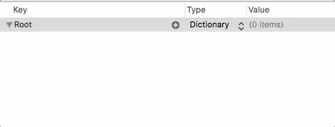
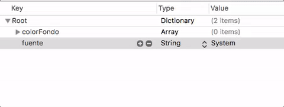

## Property lists

Las *property list* son estructuras de datos tipo pares de clave-valor ampliamente utilizadas en iOS para almacenar datos de configuración. 

Las *property list* tienen dos limitaciones prácticas fundamentales:

- No se puede almacenar cualquier tipo de datos, solo algunos: `String`, valores numéricos, `Data`, `Date` o `Boolean`. Y como colecciones de datos `Array` y `Dictionary`.
- No son modificables, es decir, no tenemos un API para cambiar un único dato en el archivo. Hay que serializar de nuevo toda la estructura y generar el archivo partiendo de cero. Por ello no son adecuadas para almacenar grandes cantidades de datos.

### El formato de las *property lists*

Las *property lists* se pueden almacenar en archivos en modo texto o binario. En los ejemplos usaremos sobre todo el modo texto. En este modo se usa el formato XML, aquí tenemos un ejemplo:

```xml
<?xml version="1.0" encoding="UTF-8"?>
<!DOCTYPE plist PUBLIC "-//Apple//DTD PLIST 1.0//EN" "http://www.apple.com/DTDs/PropertyList-1.0.dtd">
<plist version="1.0">
<dict>
    <key>colorFondo</key>
    <array>
        <integer>255</integer>
        <integer>255</integer>
        <integer>0</integer>
    </array>
    <key>fuente</key>
    <string>System</string>
</dict>
</plist>
```

La *raíz* de la estructura de datos puede ser un diccionario, como en nuestro caso, o un array.

Xcode incluye un editor de *property lists* con el que podemos editar los datos de forma "asistida" sin tener que tocar directamente el XML. Creamos una nueva lista con `File > New ` y entre las plantillas elegimos evidentemente `Property list`. La extensión típica para estos archivos es `.plist`. Lo primero que hacemos es elegir qué va a ser la *raíz* (array o diccionario) y luego vamos creando "nodos". Para cada uno tecleamos un nombre, elegimos el tipo y tecleamos el valor.



En el caso de los arrays añadimos valores "desplegando" el nodo (con la flechita que aparece a la izquierda, y pulsando sobre el botón del `+`)



> Podemos también editar el XML en modo texto pulsando con botón derecho sobre el archivo y eligiendo en el menú contextual "Open as > Source Code"

### Leer una property list

Leer una *property list* de un archivo es muy sencillo usando el *decoding* de Swift. En el *framework* Foundation se define un `PropertyListDecoder` que sirve para deserializar estos archivos.

Por ejemplo supongamos una `plist` cuya raíz es un diccionario y con dos propiedades, `nombre` de tipo `String` y `puntuacion` de tipo entero. Una vez deserializados, podemos almacenar los datos en un `struct` de Swift como este

```swift
struct Props : Codable {
    var nombre : String
    var puntuacion : Int
}
```

Cuando se crea una `plist` con Xcode se añade al *bundle* de la aplicación. Suponiendo que está en dicho *bundle* podríamos leerla con el siguiente código, que como se ve es muy sencillo gracias a `Codable`:

```swift
if let plistURL = Bundle.main.url(forResource:"mi_plist", 
                                  withExtension:"plist") {
   let data = try Data(contentsOf: plistURL)
   let decoder = PropertyListDecoder()
   let misProps = try decoder.decode(Props.self, from: data)
   print(misProps)
}
```

> En versiones anteriores de Swift la forma de leer/guardar *property list* era distinta, algo más engorrosa (aunque tampoco excesivamente complicada). Podéis consultar un ejemplo comparando el método antiguo y el nuevo [en este blog](https://useyourloaf.com/blog/using-swift-codable-with-property-lists/).

### Guardar una *property list*

Veamos cómo haríamos el paso inverso: almacenar en un archivo una estructura de datos compatible con una *property list*. 

> Recordemos que el *bundle* de la aplicación es solo de lectura, por lo que un .plist almacenado en esta localización no será modificable. La estrategia habitual es hacer que cuando arranque la aplicación se realice una copia en otro directorio con permisos de escritura, típicamente `Documents` y que a partir de entonces se trabaje con esa copia.

Suponiendo que tenemos definido el mismo `struct Props` del ejemplo anterior, haríamos uso de un `PropertyListEncoder` como sigue:

```swift
var urlDocs = FileManager.default.urls(for:.documentDirectory,
                                       in:.userDomainMask)[0]
let urlPlist = urlDocs.appendingPathComponent("result.plist")
let encoder = PropertyListEncoder()
encoder.outputFormat = .xml
let misProps = Props(nombre:"John", puntuacion:100)
let data = try encoder.encode(misProps)
try data.write(to: urlPlist)
```

