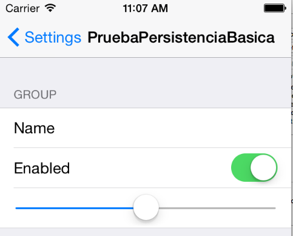

## Preferencias de usuario

En la mayoría de las aplicaciones podemos configurar una serie de parámetros que permiten adaptar su comportamiento a las preferencias o necesidades del usuario. Son elementos tales como colores, tipos de fuentes, unidades de medida, nombres de usuarios y contraseñas de servicios de terceros, etc.

iOS nos ofrece un mecanismo estándar para almacenar estas preferencias de modo permanente. El API es bastante sencillo y nos permite establecer unos valores por defecto, modificarlos según lo que diga el usuario y leer los valores previamente fijados. 

Hay que destacar que iOS solo nos da el API para leer/almacenar las preferencias, pero no el interfaz de usuario para mostrarlas/modificarlas, que es nuestra responsabilidad. Hay una excepción: si queremos que nuestras preferencias aparezcan dentro de las del sistema, el propio iOS se encargará de la interfaz.

### Qué se puede guardar en las preferencias

Desde el punto de vista del tipo de datos, las preferencias de usuario no son más que una *property list* en la que el objeto “raíz” debe ser un `NSDictionary`.

> El fichero .plist donde se serializan las preferencias estará almacenado en el directorio `Library/Preferences` de la aplicación. Su nombre será el del proyecto de Xcode, precedido del “organization identifier” del proyecto. Por defecto se genera en formato binario.  Aunque no esté en modo XML podemos igualmente abrirlo y editarlo con el editor de .plist de Xcode. También podemos convertirlo a XML con una herramienta en línea de comandos llamada `plutil`, instalada por defecto en el sistema:

    plutil -convert xml1 -o resultado_xml.plist fichero_original.plist

A primera vista parece que solo poder usar objetos de *property lists* pueda limitar bastante el ámbito de aplicación, pero hay que tener en cuenta que con un poco de ingenio probablemente no sea muy difícil transformar los datos de una clase cualquiera a un array o diccionario de cadenas, fechas y números. Y en el peor de los casos siempre podemos convertir cualquier clase propia a `NSData` mediante un proceso llamado `archiving` o `coding` (lo que en otros lenguajes como por ejemplo Java se suele denominar *serialización*). Veremos este proceso en sesiones posteriores.

### Acceder a las preferencias

Las preferencias del usuario actual son accesibles a través del *singleton* de la clase `NSUserDefaults`. Para acceder a la única instancia, usar el método de clase `standardDefaults`

    NSUserDefaults *prefs = [NSUserDefaults standardUserDefaults];

> Como las aplicaciones iOS están en un *sandbox* cada una solo tiene acceso a sus propias preferencias. El propio sistema no puede cambiar las preferencas de nuestra aplicación, salvo las que coloquemos dentro de las “generales”, como veremos en el punto siguiente

Dentro del almacén de preferencias cada una de ellas tiene una clave, que será una cadena, y un valor. Así, podemos acceder a una preferencia con una familia de métodos al estilo del `objectForKey` usado en diccionarios. Tenemos un método por cada uno de los tipos de datos que podemos tener almacenado: `integerForKey:`, `boolForKey:`, `floatForKey:`, `doubleForKey:`, `arrayForKey:`, `objectForKey:`,…

Por ejemplo:

    NSString *nick = [prefs stringForKey:@"nick"];
    NSInteger creditos = [prefs integerForKey:@"creditos"];

Hay un pequeño problema con el código anterior: si no se hubiera guardado una preferencia con la clave `creditos` el valor obtenido sería 0. Pero ¿cómo diferenciar si la preferencia se ha fijado a 0 o bien no se ha fijado?. La solución más adecuada pasa por registrar *valores por defecto* para todas las preferencias, de modo que no pueda haber una preferencia con un valor no fijado, bien sea porque se ha hecho por defecto o bien sea porque lo ha hecho el usuario.

  
### Registrar valores por defecto

Podemos registrar un conjunto de preferencias por defecto pasándole un diccionario al método `registerDefaults` de `NSUserDefaults`:

    NSUserDefaults *prefs = [NSUserDefaults standardUserDefaults];
    [prefs registerDefaults:@{
              @"nick": @"(anonimo)",
              @"creditos" : @100
     }];

Hay que destacar que *los valores registrados por defecto no son permanentes*. Es decir, que hay que registrarlos cada vez que arranque la aplicación.

Si registramos un valor por defecto y este ya ha sido fijado por el usuario el valor por defecto no “machacará” al ya fijado. Cuando iOS busca el valor para una preferencia sigue un esquema de “dominios”, en el que si no encuentra la clave en un dominio la busca en el siguiente. De este modo, primero busca en el dominio de los valores fijados por el usuario y si lo encuentra aquí lo devuelve. Es solo si no lo encuentra aquí cuando pasa a consultar los valores por defecto.

En un poco tedioso tener que volcar en el código un `NSDictionary` con todos los valores por defecto. Un método muy habitual de registrar los valores por defecto de modo más “limpio” es almacenarlos en un archivo `.plist` y deserializarlos con `initWithContentsOfFile`, como vimos en el apartado de cómo leer *property lists*.

### Modificar las preferencias

Simplemente tenemos que fijar la clave al valor que queramos usando la familia de métodos `setXXX:forKey:`

    NSUserDefaults *prefs = [NSUserDefaults standardUserDefaults];
    [prefs setObject:@"Pepito" forKey:@"nick"];
    [prefs setInteger:50 forKey:@"creditos"];

Por cuestiones de eficiencia, iOS no hace persistente el cambio inmediatamente sino a intervalos regulares o en momentos especiales (por ejemplo justo antes de salir de la aplicación). Una *property list* no se puede modificar de manera parcial y hay que crearla entera de nuevo, de manera que no sería eficiente persistir siempre los datos tras ejecutar el `setXXX:forKey:`. 

Una forma de “forzar” la persistencia si estamos probando la aplicación es salir de ella pulsando en el botón “home” (`Shift+Cmd+H` en el simulador) para que pase a *background*, momento en el que, como ya hemos dicho, iOS almacena de modo permanente los valores actuales. 

> Como iOS tiene que modificar los datos si hay preferencias modificadas desde la última vez que se guardaron, no es aconsejable cambiar el valor de una preferencia “a las primeras de cambio”. Solo es adecuado si no es previsible que vaya a cambiar dentro de poco tiempo. Una estrategia típica es fijar los valores justo antes de salir de la aplicación.

### Ubicar las preferencias en el “panel de control” general

El sistema nos da la posibilidad de controlar ciertas preferencias de nuestra aplicación dentro de las preferencias generales del sistema, en un apartado reservado a ella. Esto es lo que se conoce en iOS como un *settings bundle*. Podemos colocar aquí todas las preferencias o solo algunas.

> Apple recomienda colocar en el sistema solo las preferencias que se cambien en raras ocasiones. Por ejemplo en una aplicación que gestione un servicio de terceros podemos colocar aquí las credenciales de uso del servicio (login y password)

A diferencia de las preferencias dentro de la aplicación, donde iOS nos da un API para editarlas/verlas pero no una interfaz, en este caso es al contrario. Editando un fichero `.plist` con un formato especial podemos crear de modo sencillo una interfaz para las preferencias. 

Para crear un *settings bundle* en Xcode ir a `File > New > File ...` y en el cuadro de diálogo que aparecerá, dentro del tipo `Resource` elegir  `Settings Bundle`. Se creará un archivo de tipo *property list* llamado `Root.plist` y algunos archivos auxiliares para la internacionalización (necesarios ya que vamos a tratar con elementos de interfaz).

Si editamos el `Root.plist` con el editor de Xcode podemos ver que tiene un formato un tanto especial: la lista de preferencias se representa con un array de items. Las propiedades de estos items son las que determinan el tipo de *widget* a usar para editar/ver la preferencia, sus parámetros y la clave con la que se va a almacenar la preferencia asociada. 

En el ejemplo que se muestra a continuación, que se corresponde con el `Root.plist` que crea por defecto Xcode, puede verse que el item 1 es de tipo “campo de texto”, que su `title` (la etiqueta que se ve en las preferencias) es `Name`, que el *widget* tiene una serie de propiedades (cuando se edita aparece un teclado alfabético,  no es seguro - o sea, se muestra el contenido, …) y está asociada a la preferencia cuya clave es `name_preference` (propiedad `Identifier`). 

No tenemos espacio en estos apuntes para explicar más detalladamente el proceso de configuración del *bundle*. El lector interesado puede consultar el apartado “[implementing an iOS settings bundle](https://developer.apple.com/library/ios/documentation/Cocoa/Conceptual/UserDefaults/Preferences/Preferences.html)” de la “[Preferences and Settings Programming Guide](https://developer.apple.com/library/ios/documentation/Cocoa/Conceptual/UserDefaults/Introduction/Introduction.html#//apple_ref/doc/uid/10000059i-CH1-SW1)” de Apple.

