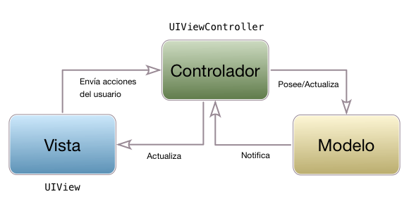
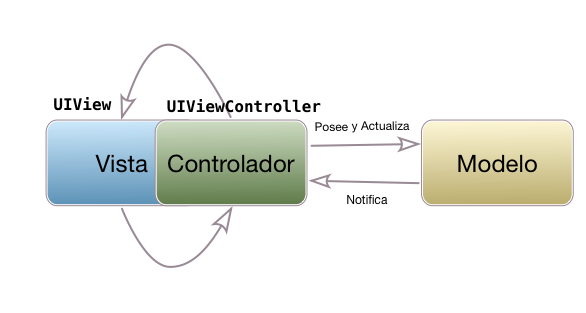

## Modelo/Vista/Controlador

### Los problemas de MVC

En teoría la estructura de una aplicación iOS con MVC debería ser sencilla y "limpia", ya que cada uno de los tres componentes tiene una responsabilidad separada. 



En la práctica, la principal fuente de problemas de esta arquitectura es el *controlador*. Por un lado, el `UIViewController` está tan **unido a la vista** que acaba siendo parte de ella en lugar de un componente separado. En la realidad la arquitectura de muchas aplicaciones iOS acaba pareciéndose más a la siguiente figura que a la anterior:



Al estar tan acoplado el controlador a la vista se hace casi imposible hacer *testing* del controlador en sí, sin probar la interfaz de usuario, ya que tendríamos que hacer un *mock* de todos los componentes de la vista que interactúan con el controlador.

Por otro lado es fácil "dejarse llevar" y acabar asignándole **demasiadas responsabilidades** al controlador: colocar en él lógica de negocio, hacer que sea el *datasource* o el *delegate* de las tablas que contiene,... Esto da lugar a lo que de modo irónico se conoce como *massive view controller*.

> Casi todos los tutoriales y ejemplos sobre *frameworks* o APIs de iOS que encontraréis en la web o en los libros tienen este problema, incluyendo muchas veces el material que os damos en este curso. Como el objetivo del tutorial o del ejemplo es aprender sobre el *framework*/API que no conoces, se tiende a poner todo el código en el *view controller*, evitando crear clases adicionales que añadirían complejidad al ejemplo y distraerían del objetivo principal. Pero por desgracia el resultado final es un *Massive View Controller*.

Para solucionar todos estos problemas podemos usar una arquitectura distinta a MVC, como veremos en apartados posteriores. Pero no todo son problemas en MVC tal como lo propone Apple: tiene la ventaja de estar especialmente adaptado a la filosofía de la plataforma, los *frameworks* y los APIs de iOS, y además es una arquitectura sencilla. Una alternativa sería continuar usándolo pero intentar "aligerar" el controlador en la medida de lo posible para hacer el código más mantenible. Vamos a ver cómo podríamos hacerlo.

### Controladores "ligeros"

Básicamente la idea es dejar en el controlador el mínimo de código imprescindible para coordinarse con el modelo y con la vista, que es la que debería ser su única labor. Esto no es más que una aplicación del "Principio de responsabilidad única" (Single Responsibility Principe), un principio básico en el diseño y desarrollo de software que sostiene que *cada componente debería tener una única responsabilidad o funcionalidad en el sistema*. Esto no solo mejora la estructura del código, sino que también facilita el testing y mejora la mantenibilidad de la aplicación.

Si "nos dejamos llevar" y colocamos todo el código de la aplicación en el *view controller*, al final puede acabar teniendo las siguientes responsabilidades:

- Almacenar temporalmente y modificar los datos de la aplicación
- Implementar al menos parte de la lógica de negocio, que debería estar únicamente en las clases del modelo
- Implementar la persistencia de datos. Si además usamos Core Data y necesitamos listar datos con un *fetched results controller*, el *view controller* acaba teniendo que convertirse en su *delegate*.
- En caso de tener una tabla:
    - Típicamente es *datasource* y *delegate* de la misma
    - Al ser el *datasource*, se tiene que encargar de rellenar todos los datos de cada celda, por lo que tiene que conocer su estructura
- El *view controller* acaba convirtiéndose la mayoría de veces en el *delegate* de los componentes de interfaz que requieren uno, por ejemplo los *sliders* o los *datepickers*.
- Muchas veces cuando de un *view controller* se salta a otro este le pasa los datos fijando propiedades en el *view controller* destino. Eso implica un conocimiento de la estructura interna de este *controller*.

Básicamente la solución es relativamente de "sentido común" y consiste en extraer todas estas funcionalidades a clases/*structs* adicionales. Vamos a ver algunas ideas genéricas de cómo se podrían hacer estas refactorizaciones.

#### Separación de los *datasources*/*delegates*

Vamos a ver cómo se podría extraer el *datasource* de una tabla. Un *delegate* sería similar. Intentaremos hacer una clase genérica que nos pueda servir en varios proyectos. Dicha clase:

- Por supuesto implementa los métodos del protocolo `UITableViewDataSource`
- Contiene un array con los objetos a mostrar, ya que es la forma más sencilla de representar los datos.
- Acepta en el constructor una clausura que se encarga de rellenar los campos de una celda a partir de un objeto

```swift
import Foundation
import UIKit

class ListaItemsDataSource<Item> : NSObject, UITableViewDataSource {
    private var items : [Item]
    private var idCelda : String
    private var configurarCelda : (UITableViewCell, Item) -> Void
    
    init(listaItems: [Item], idCelda : String, configurarCelda : @escaping (UITableViewCell, Item) -> Void) {
        self.items = listaItems
        self.idCelda = idCelda
        self.configurarCelda = configurarCelda
    }
    
    func tableView(_ tableView: UITableView, numberOfRowsInSection section: Int) -> Int {
        return items.count
    }
    
    func tableView(_ tableView: UITableView, cellForRowAt indexPath: IndexPath) -> UITableViewCell {
        let cell = tableView.dequeueReusableCell(withIdentifier: self.idCelda, for: indexPath)
        self.configurarCelda(cell, self.items[indexPath.row])
        return cell
    }   
}
```

Y aquí tenemos un *view controller* de ejemplo que hace uso de esta clase. Por ejemplo supongamos que queremos mostrar una lista de objetos `Persona`

```swift
class MiController: UIViewController {
    var miDataSource : ListaItemsDataSource<Usuario>!

    override func viewDidLoad() {
        super.viewDidLoad()

        //Tendríamos que obtener los datos de algún sitio, p.ej. de Core Data
        let lista = ...
        self.miDataSource = ListaItemsDataSource<Usuario>(listaItems: lista, idCelda: "MiCelda") {
            celda,persona in
              celda.textLabel?.text = persona.nombre
              let df = DateFormatter()
              df.dateFormat = "dd/MM/yyyy"
              let fechaString = df.string(from: persona.fechaNacimiento)
              celda.detailTextLabel?.text = fechaString
        }
        self.tableView.dataSource = self.miDataSource
    }
}
```
    

#### Extraer el código de configuración de la celda

En el código anterior el View Controller sigue teniendo que ocuparse de rellenar los campos de la celda, lo que hace que tenga que conocer su estructura: en el ejemplo, que la celda tiene un `textLabel` y un `detailTextLabel` y también que tenga que ocuparse de formatear los datos, por ejemplo la fecha.

Podemos encapsular la información sobre la "estructura interna" de la celda en una nueva clase, que en MVC pertenecería a la vista. 

```swift
class CeldaPersona : UITableViewCell {
    static let idCelda = "MiCelda"
    var nombre : String? {
        didSet {
            self.textLabel?.text = self.nombre
        }
    }
    var fecha : Date? {
        didSet {
            let df = DateFormatter()
            df.dateStyle = .short
            self.detailTextLabel?.text = df.string(from: self.fecha!)
        }
    }
}
```

Nótese que ahora "desde fuera" para configurar la celda lo único que hay que hacer es fijar el valor de las propiedades "texto" y "fecha". Los `didSet` se encargarán automáticamente de rellenar los campos de la celda con el formato adecuado.

De este modo el *view controller* quedaría aún más sencillo

```swift
class MiController: UIViewController {
    var miDataSource : ListaItemsDataSource<Usuario>!

    override func viewDidLoad() {
        super.viewDidLoad()

        //Tendríamos que obtener los datos de algún sitio, p.ej. de Core Data
        let lista = ...
        self.miDataSource = ListaItemsDataSource<Usuario>(listaItems: lista, idCelda: "MiCelda") {
            celda,persona in
              if let celdaPersona = celda as? CeldaPersona {
                celdaPersona.nombre = persona.nombre
                celdaPersona.fecha = persona.fechaNacimiento
              } 
        }
        self.tableView.dataSource = self.miDataSource
    }
}
```

Para que el *cast* de `celda as CeldaPersona` pueda tener éxito, en Xcode habrá que seleccionar la celda prototipo en el *storyboard* y cambiar en el "identity inspector" del panel derecho la clase de la celda por `CeldaPersona`.

