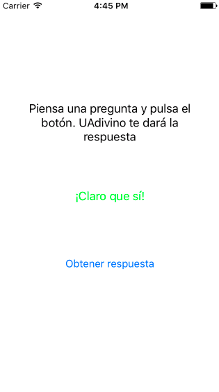
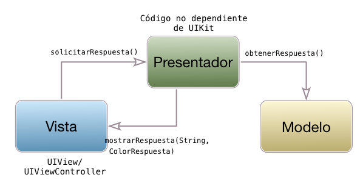

## Model/View/Presenter

Este patrón de diseño soluciona algunos de los problemas que tiene el MVC "al estilo Apple". El nuevo componente, llamado *presenter* se encarga de la *lógica de presentación*, y debe ser independiente de la tecnología que se esté usando para la vista, que en iOS será `UIKit`. La lógica de presentación engloba todas las operaciones necesarias para formatear los datos del modelo de modo que se puedan visualizar adecuadamente. Por ejemplo es posible que el modelo nos devuelva la distancia total de una ruta, y queramos que se pueda visualizar en metros o kilómetros. La conversión de unidades sería responsabilidad del *presenter*.

A primera vista el diagrama de componentes anterior parece muy similar al original de MVC, simplemente sustituyendo el *controller* por el *presenter*. No obstante, el que el *presenter* deba ser independiente de la tecnología de la vista tiene un impacto bastante importante en el código. En las aplicaciones debemos seguir usando `UIViewControllers`, ya que son una parte básica de la plataforma. Sin embargo esta clase no es totalmente independiente de la tecnología de la vista, porque está íntimamente unida a ella. De hecho, esto era uno de los problemas que teníamos en el MVC "estilo Apple". Por eso, **en MVP consideraremos al *view controller* como parte de la vista**. Es decir, el *presenter* de ningún modo es el antiguo *controller* bajo otro nombre, sino algo totalmente distinto.

Vamos a verlo a través de un ejemplo. Usaremos la aplicación `UAdivino`, que fue nuestra primera aplicación iOS en Swift. Recordemos que se trata de una *app* a la que se le "formula una pregunta" (*¿Aprenderé Swift?*) y nos da una contestación positiva o negativa (*claro que sí*, o *ni de casualidad*). Vamos a hacer que si la contestación es positiva se muestre en color verde y si es negativa en color rojo. 

Lo primero que vamos a hacer es formalizar la interfaz de los tres componentes, modelo, vista y presentador, usando protocolos. El diagrama de componentes quedaría del siguiente modo:

Cuando se pulsa el botón de "obtener respuesta" la *vista* llama a `solicitarRespuesta()` del *presentador*. Este a su vez le pide al modelo que "haga el trabajo", generando una respuesta al  azar. La respuesta contiene un texto y un booleano indicando si es positiva o negativa. Con este último el *presentador* calcula el color (verde o rojo, respectivamente), y le pasa texto y color a la vista para que lo muestre. En este caso la "lógica de presentación" consiste simplemente en calcular el color correspondiente a la respuesta.

> Al ser este un ejemplo muy sencillo el modelo no necesita notificaciones para "avisar" al *presentador* de que hay datos que mostrar. Una aplicación que hiciera una búsqueda en un servicio web llamaría a un *callback* del *presenter* cuando se hubieran recibido los datos.

Podéis ver el [código fuente completo](https://github.com/ottocol/ejemplos-arquitectura-iOS/tree/master/MVP) en el repositorio de GitHub.

### Ensamblado de la arquitectura

*vista* y *presentador* deben comunicar el uno con el otro, así que cada uno debe tener una referencia al otro.

