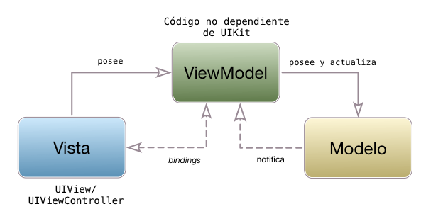

## MVVM

### MVVM vs. MVP

El patrón de diseño Model/View/ViewModel es muy similar al MVP que vimos en el apartado anterior. 



De hecho, el *ViewModel* tiene más o menos la misma funcionalidad que el *presenter*, implementar la lógica de presentación y aislarla de la tecnología concreta usada para la presentación.

¿Dónde está la diferencia entonces?. En que MVVM soluciona uno de los principales problemas que tiene MVP, el acoplamiento entre vista y *presenter*. Como estuvimos discutiendo, la *vista* y el *presenter* deben "conocerse" mutuamente, ya que la vista debe comunicarle a este las acciones del usuario, y el *presenter* enviarle a la vista los datos a mostrar. Esto hace que ambos componentes estén acoplados entre sí, ya hemos visto en el código de ejemplo de MVP que en la vista hay una referencia al *presenter* y viceversa. En MVVM no existe este acoplamiento, y lo vamos a evitar usando *bindings*, es decir, vinculación automática entre los datos de la modelo y el *presenter*, de manera que cuando cambie alguno de ellos se modifique automáticamente el otro. Esto permite que el código quede mucho más "limpio", ya que no hay que actualizar el otro componente de modo explícito.

En iOS no hay ninguna tecnología estándar para vincular elementos de la vista con propiedades del modelo (aunque en OSX sí existe). Podríamos usar KVO o notificaciones para hacer la vinculación, pero la implementación sería un poco tediosa. Así que tendremos que usar alguna librería de terceros. Aquí veremos una bastante sencilla de usar llamada [Bond](https://github.com/ReactiveKit/Bond) (el nombre completo es Bond, Swift Bond :)).

> Para implementar los *bindings* podríamos usar también algún *framework* de *reactive programming*. Este paradigma de programación permite implementar la funcionalidad de manera bastante elegante. No obstante usar un *framework* de este tipo solo para implementar *bindings* probablemente sea demasiado, ya que la idea de *reactive programming* es bastante más amplia. En cualquier caso es posible que encontréis tutoriales y otros recursos de MVVM en iOS que usen *frameworks* reactivos como [ReactiveCocoa](https://github.com/ReactiveCocoa/ReactiveCocoa) o [RXSwift](https://github.com/ReactiveX/RxSwift). De hecho, Bond está construido sobre un *framework* de este tipo, aunque más sencillo. Y como se verá, en el ejemplo usaremos funcionalidades típicas de *programación reactiva*.

### MVVM con la librería "Bond"

Vamos a verlo con un ejemplo, ya que así se entenderán mejor los conceptos. Implementaremos ahora una versión MVVM de la aplicación `UAdivino`, al estilo de la que hicimos en el apartado anterior, es decir, mostrando cada tipo de respuesta de un color distinto. La diferencia fundamental va a estar en que vincularemos de modo automático tanto el texto de la respuesta como el color para que no haga falta fijarlos de forma explícita en la vista. Esta vinculación la haremos gracias a la librería Bond.

La forma más sencilla de configurar un proyecto de Xcode con Bond es usando Cocoapods. En el README de Bond en Github están [las instrucciones](https://github.com/ReactiveKit/Bond#installation). Vamos a empezar a trabajar suponiendo que ya se ha hecho esta configuración. Como en el caso de la versión MVP podéis consultar el [código fuente completo](https://github.com/ottocol/ejemplos-arquitectura-iOS/tree/master/MVVM/UAdivino) en GitHub.

#### Vinculación de *viewmodel* a vista

Al vincular un *origen* con un *destino* lo que hacemos es que cuando el primero cambia, el segundo también lo hace automáticamente. Esto simplifica mucho el código ya que podemos cambiar una propiedad del *viewmodel* y que se refleje automáticamente en la vista, o viceversa.

En nuestro ejemplo del `UAdivino` queremos vincular dos propiedades del *viewmodel* con la vista: el texto de la respuesta y el color de la misma. En la librería Bond los *bindings* se basan en la idea de **observable**. Esta es una idea similar a la de los eventos. Podemos indicar que queremos observar un elemento *observable* de modo que se nos "avisará" de cuándo cambia su valor. No obstante a diferencia de los eventos, que ya suelen estar predefinidos en el sistema, podemos crear los observables "bajo demanda" y además como veremos se pueden manipular, transformar y combinar permitiéndonos hacer cosas complejas de modo relativamente sencillo. La idea de observable es la idea fundamental tras el paradigma de **programación reactiva**, aunque en este paradigma suele recibir otros nombres, siendo el más típico el de *stream* (en librerías como ReactiveCocoa se denominan *signals*).

Así, definiremos el texto de la respuesta como un observable "de tipo" `String` en lugar de simplemente como un `String`, para poder vincularlo a la vista. En el *viewmodel* haríamos esto para crear el observable con un valor inicial de "" (cadena vacía):

```swift
import Bond

let textoResp = Observable<String>("")
```

Nótese que `textoResp` no es un `String` sino un *observable*. El valor que hay "dentro" del observable es accesible a través de su propiedad `value`

```swift
print(textoResp.value) //imprimirá la cadena vacía
textoResp.value = "hola"
```

Para vincular una propiedad de un elemento de `UIKit` con un observable usamos el método `bind(to:)`. La librería Bond extiende los elementos de interfaz añadiéndoles una propiedad `reactive`. Dentro de esta es donde están las propiedades "vinculables". Por ejemplo el texto de un campo estaría en `reactive.text`, el color en `reactive.textColor`, etc.

Supongamos que en la vista tenemos el *viewmodel* accesible en la propiedad `viewModel` (como veremos en el apartado siguiente). Entonces haríamos algo como:

```swift
self.viewModel.textoResp.bind(to:self.labelRespuesta.reactive.text)
```

para vincular el observable `textoResp` del *viewmodel* al texto de la etiqueta `labelRespuesta`. A partir de este momento cada vez que el *viewmodel* cambie el valor del observable se cambiará también el mensaje en la pantalla.

Vamos a ver ahora la vinculación entre el color de la respuesta y el que se muestra en pantalla. El *viewmodel* usa un tipo propio enumerado, `ColorRespuesta` para representar el color con que se debería mostrar la resupesta. Por tanto en el *viewmodel* crearemos un observable de este tipo con un valor inicial cualquiera.

```swift
let colorResp = Observable<ColorRespuesta>(.verde)
```

> En iOS lo más sencillo para representar colores es usar la clase `UIColor`, pero recordemos que el *viewmodel* no debería contener código de `UIKit`, por eso usamos el tipo propio `ColorRespuesta`.

Ahora el problema es que no podemos vincular directamente el color del *label* con este observable, ya que el color de los elementos de la interfaz es un `UIColor` y nosotros tenemos un tipo distinto. Sin embargo una idea bastante poderosa de **los observables** es que **se pueden transformar** y además de modo encadenado. Para ello se pueden usar las primitivas típicas de programación funcional (`map`, `filter`,...) y además algunas adicionales, dando lugar a lo que se conoce como FRP (*Functional Reactive Programming*). Por tanto lo que haremos será transformar el observable en un `UIColor` y vincular con este (ya que la transformación de un observable es también un observable, lo que nos permite encadenar operaciones). En la vista haríamos algo como:

```swift
viewModel.colorResp
    .map {
       color in
       return (color == .verde ? UIColor.green : UIColor.red)
    }
    .bind(to: self.labelRespuesta.reactive.textColor)
```

Recordemos que `map` parte de un valor y devuelve el valor transformado gracias a la clausura que se le pasa como parámetro.

#### Vinculación de vista a *viewmodel*

En el ejemplo de `UAdivino` no hay ningún caso de uso de vinculación en la dirección contraria, es decir, de la vista hacia el *viewmodel*, así que pondremos otro ejemplo. Supongamos un campo de texto en que el usuario escribe un texto de búsqueda. En la vista tendremos definido un *outlet* que referencie el campo de texto. Vincularemos desde la propiedad `reactive.text` del campo hacia la propiedad correspondiente del *viewmodel*. Pero cuidado, el destino no puede ser un tipo "normal" de Swift sino que debe ser un `Observable`
En el *viewmodel*

```swift
var textoBusqueda = Observable<String>("")
```

En la vista, suponiendo que el *viewmodel* es accesible a través de la propiedad `viewModel`:

```swift
self.campoTexto.reactive.text.bind(to:viewModel.textoBusqueda)
```

Podemos establecer también una **vinculación bidireccional** de modo que cuando cambie cualquiera de los dos lados cambie el otro (de la propiedad a la vista y viceversa). Esto lo haríamos simplemente usando `bidirectionalBind` en lugar de `bind`

```swift
self.campoTexto.reactive.text.bidirectionalBind(to:viewModel.textoBusqueda)
```

#### "Ensamblaje" de modelo, *viewmodel* y vista 

Al igual que en el caso de MVP, hay que conectar las "piezas": modelo, *viewmodel* y vista. Como según el esquema del patrón la vista "posee" al *viewmodel*, definiremos este como una propiedad de la vista:

```swift
class UAdivinoView : UIViewController {
   let viewModel = UAdivinoViewModel()
   ...
} 
```

Y como el *viewmodel* "posee" al modelo definiremos este como una propiedad del primero:

```swift
class UAdivinoViewModel {
   let model = UAdivinoModel(nombre: "Rappel")
   ...
}
```


En MVVM, una parte importante del ensamblaje es **inicializar los *bindings***. Una forma sencilla de hacer esto es en el `viewDidLoad` de la vista:

```swift
override func viewDidLoad() {
   self.bindViewModel()
}

func bindViewModel() {
    //conectamos viewModel.textoResp -> texto del label
    viewModel.textoResp.bind(to: self.labelRespuesta.reactive.text)
    ...
}
```
