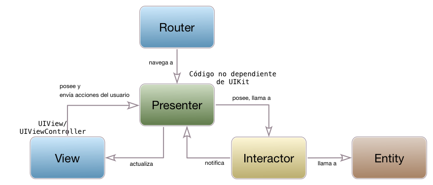
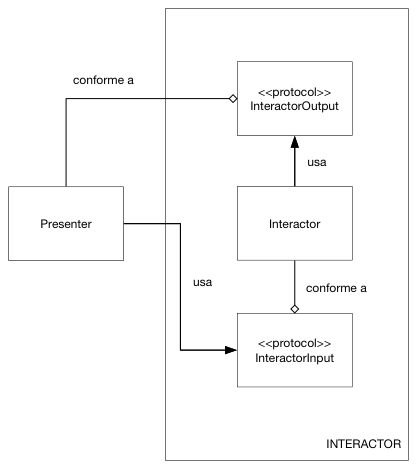

## VIPER

MVP y MVVM son un paso más en la separación de responsabilidades en los componentes de la aplicación, pero no dejan claro cómo estructurar el modelo. Además algunas cosas quedan fuera de la arquitectura, como es el caso del cambio de pantallas en la aplicación: típicamente habrá un MVVM por cada pantalla, pero ¿quién decide a dónde ir saltando y cómo hacerlo?.

VIPER (View/Interactor/Presenter/Entity/Router) es una arquitectura que intenta solucionar o al menos abordar estos problemas.

### Qué es VIPER

VIPER es una adaptación a iOS de la *Clean Architecture* propuesta por el "gurú" de la ingeniería del software [Robert C. Martin](http://blog.cleancoder.com/), conocido familiarmente como "Uncle Bob". El *tío Bob* ha explicado los detalles de su *clean architecture* en múltiples ocasiones, por ejemplo en [su blog](https://8thlight.com/blog/uncle-bob/2012/08/13/the-clean-architecture.html) y en [algunas charlas](https://www.youtube.com/watch?v=Nsjsiz2A9mg). VIPER aparece descrito por primera vez en [este artículo](https://www.objc.io/issues/13-architecture/viper/) de 2014.

Igual que sucedía con los "controladores ligeros" en MVC, una de las ideas básicas de la *Clean Architecture* y por tanto de VIPER es llevar a la práctica el "Principio de Única Responsabilidad".

## Componentes de la arquitectura

Como hemos enumerado antes, los componentes son los siguientes:

- *View*: muestra los datos que le pasa el *presenter*, y le pasa a este las acciones del usuario. Como vemos es el mismo papel que desempeña en MVP o MVVM.
- *Interactor*: es la lógica de negocio, los casos de uso de nuestra aplicación. Típicamente cada módulo VIPER implementará un caso de uso distinto.
- *Presenter*: contiene la lógica de presentación, al igual que en MVP.
- *Entity*: los modelos del dominio. Se podría decir que contienen la lógica de negocio "genérica" mientras que el *interactor* contiene la lógica propia de nuestra aplicación.
-  *Router*: contiene la lógica de navegación, para saber qué pantallas mostrar y cómo cambiar entre ellas. En algunos sitios se conoce también como *wireframe*

Los componentes se comunican entre sí según se indica en el siguiente diagrama:

## Principios básicos de VIPER

Además de los componentes que lo forman y la forma de comunicarse entre ellos, hay unas cuantas ideas adicionales importantes en VIPER.

La primera de ellas es que **todos los componentes se comunican entre sí a través de protocolos** (o interfaces, como diríamos en otros lenguajes). Esto hace posible sustituir una implementación de un componente por otra sin afectar al resto del componentes. Es decir, seguimos el principio básico del desarrollo software de *programar contra interfaces y no contra implementaciones*.

En la *clean architecture* original se hablaba de dos tipos de interfaces: *input ports* y *output ports*, y en la mayoría de implementaciones de VIPER se ha conservado esta idea y terminología. Para un componente, su *input port* lo constituyen las operaciones que él implementa, y que serán llamadas desde otros componentes. El *output port* serán las operaciones que el componente necesita, implementadas por otro componente. Si tenemos dos componentes, A y B, y A necesita de B, el *output port* de A será el mismo protocolo o interfaz que el *input port* de B. 

La misión de estos *output ports* es conseguir lo que se llama **inversión de dependencias**. Veamos qué es esto. Si nos fijamos en el diagrama principal de VIPER veremos que conforme nos movemos de izquierda a derecha vamos yendo de lo más "concreto" y poco reutilizable a lo más "abstracto", reutilizable e independiente de los APIs de iOS. La vista está totalmente atada a `UIKit`, mientras que en el otro extremo el `Interactor` debería ser igual para cualquier plataforma, salvo por el hecho de estar escrito en Swift. Si pensamos en los componentes como capas (más internas conforme avanzamos hacia la derecha),  es adecuado que un componente de una capa dependa de los de las capas internas, pero no a la inversa, ya que estaríamos haciéndolo depender de "detalles de implementación" que están por debajo de su nivel de abstracción: un ejemplo: cuando el *interactor* termina su trabajo y debe devolver los datos al *presenter* tiene que llamarlo para pasárselos, pero para no introducir dependencias incorrectas debe hacerlo a través de un protocolo. Y además este protocolo debería implementarse en el "paquete" del *interactor*, para evitar dependencias directas de código de *interactor* a *presenter*. Este protocolo sería el `InteractorOutput`. Y esto se llama *inversión de dependencias* porque aunque el *interactor* llama al *presenter* en código no depende de él.

Otra idea importante es **qué datos se pasan entre los componentes**. Vamos a verlo con un ejemplo. Si estamos haciendo una aplicación de tareas pendientes probablemente tendremos una entidad llamada `Tarea`. Por ejemplo, cuando listamos las tareas pendientes las recuperará el *interactor* (quizá usando Core Data), que se las pasará al *presenter* (que formateará los datos adecuadamente, por ejemplo las fechas), y este a su vez a la *vista* para que las muestre en pantalla. Probablemente lo más directo sería pasar objetos `Tarea` de un componente a otro, pero esto tiene el problema de que estamos acoplándolos todos a la entidad, y si cambiamos esta tendremos que cambiar todos los componentes. Por eso en VIPER y en *clean architecture* se recomienda pasar solamente los datos que se necesiten y además en un formato *ad hoc*, típicamente `structs` o tuplas de datos. 

## Ventajas e inconvenientes

Las ventajas de VIPER son las de cualquier arquitectura bien diseñada:

- Facilita la colaboración en el equipo de desarrollo, si cada desarrollador se ocupa de un componente separado o un conjunto de componentes.
- Facilita el mantenimiento de la aplicación.
- Hace posible el *testing*.

Como inconveniente principal está la sobrecarga que supone crear un mínimo de 5 componentes por cada módulo. Es una arquitectura que para aplicaciones pequeñas o para aplicaciones implementadas por un solo desarrollador quizá presenta una complicación excesiva.

