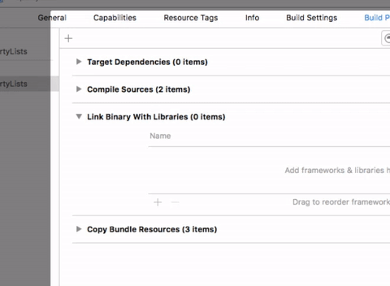
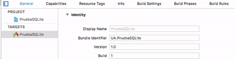

## Introducción a SQLite en iOS

En iOS no hay ningún *framework* estándar para trabajar con SQLite de forma nativa. Lo más habitual es usar directamente el [API C de la librería](http://www.sqlite.org/c3ref/intro.html). Al ser C un subconjunto de Objective-C (e interoperable con Swift) usar este API no es mayor problema, salvo por el “engorro” de tener que emplear funcionalidades de bajo nivel y tipos de datos de C (`char *` en lugar de `String`, por ejemplo).

Como vamos a ver, el API es considerablemente de nivel más bajo que los que habéis usado en Android. Es muy improbable que en el futuro aparezca en iOS un API SQLite de nivel más alto, ya que Apple recomienda el uso del *framework* "Core data" sobre el uso directo de SQLite (como veremos, Core Data usa habitualmente SQLite de modo interno). No obstante, para casos de uso relativamente sencillos SQLite va a ser una alternativa mucho más ligera en recursos que Core Data. Además SQLite supone una barrera de entrada bastante baja para cualquier desarrollador habituado a trabajar con SQL y bases de datos, cosa que no se puede decir de Core Data.

### Configurar el proyecto {#config_sqlite}

Para poder usar SQLite en un proyecto iOS primero hay que **añadir manualmente la librería**, no se añade automáticamente al contrario que otros *frameworks*. Seleccionamos el icono del proyecto (el azul) y en las propiedades del proyecto, opción `General`, al final del todo (`Linked frameworks and libraries`) pulsar sobre `+` y añadir `libsqlite3.tdb`.

> En versiones de XCode anteriores a la 7, la librería a incluir tenía extensión `.dylib` en lugar de `.tdb`



Para poder usar código C en un proyecto Swift necesitamos crear un archivo especial con los `include` necesarios. Esto es lo que se llama un *bridging header*.

Para **crear el *bridging header*** vamos en Xcode a `File > New > File...` y en las plantillas seleccionamos "header file". Le damos cualquier nombre, por ejemplo `b-h.h`. El contenido de la plantilla que crea Xcode no nos sirve, debemos borrarlo y sustituirlo simplemente por esto:

```c
#include <sqlite3.h>
```

Ahora debemos decirle a Xcode que este `.h` es efectivamente un *bridging header*. Para eso seleccionamos el icono del proyecto (el azul) y en el apartado `build settings` seleccionamos `All` y en el cuadro de búsqueda buscamos "bridging header". Aparecerá una opción llamada `Objective-C Bridging Header`, que estará vacía, y en la que debemos escribir el nombre de nuestro `b-h.h` (si lo has metido en una carpeta dentro del proyecto tendrás que poner delante su nombre)



> Este proceso es mucho más simple cuando importamos directamente código C u Obj-C a nuestro proyecto, ya que al añadir el `.c` o `.m` Xcode lo detecta y crea y configura el *bridging header* automáticamente. No es este el caso, ya que aquí estamos usando una librería ya compilada. 

### Incluir la base de datos en el proyecto

La forma más típica de incluir la base de datos en el proyecto es copiarla al *bundle* de la aplicación. 

> **No arrastres** el archivo desde el *finder* hasta la ventana de Xcode. Se copiará en el directorio del proyecto pero no en el *bundle* de la aplicación

Pulsa con el botón derecho sobre el proyecto y selecciona la opción de `Add files to "(nombre_del_proyecto)"`. En el cuadro de diálogo que aparecerá, seleccionar el archivo con la base de datos, pulsar sobre el botón `Options` y **asegurarse de que está marcada la casilla `Copy items if needed`**, para hacer una copia en el directorio del proyecto y no usar simplemente una referencia al archivo original.


