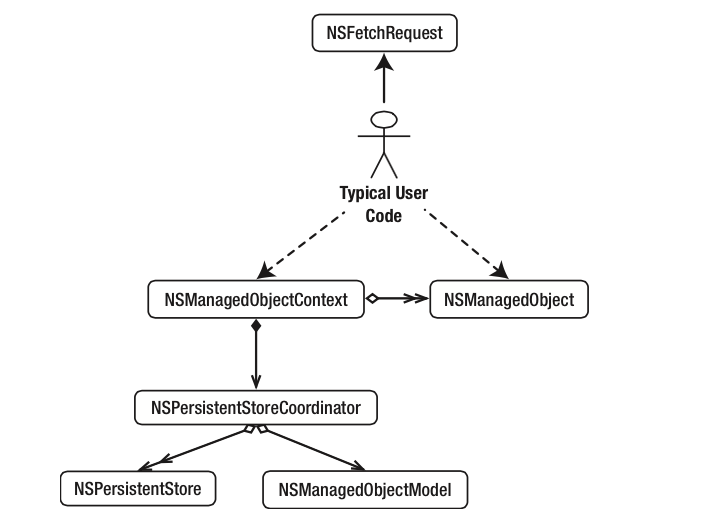

## Introducción a Core Data

### ¿Qué es Core Data?

Core Data es el principal *framework* de persistencia de iOS. Nos proporciona un mecanismo para poder almacenar de forma persistente los objetos de nuestra aplicación y luego recuperarlos. Es capaz de guardar automáticamente un grafo entero de objetos con las relaciones (uno a uno, uno a muchos, muchos a muchos) que hay entre ellos. Si bien es un API complejo y tiene una curva de aprendizaje pronunciada, para cualquier aplicación medianamente grande usar Core Data nos va a resultar mucho más sencillo que implementar nosotros la persistencia de manera manual con, digamos, SQLite.

Core Data se puede considerar en cierto modo como un ORM (*object relational mapper*). A los desarrolladores que hayan usado un ORM en cualquier lenguaje les va a resultar familiar si no el API sí al menos las ideas básicas y la filosofía de trabajo. Aún más, ciertos términos usados en Core Data (objetos gestionados, contexto, ...) son típicos también de otros ORM como por ejemplo JPA en Java. 

Siendo puristas, Core Data no es un ORM estrictamente hablando, ya que su objetivo no es la persistencia únicamente en bases de datos relacionales. En principio el *backend* de persistencia podría ser cualquiera. Con la implementación actual Core Data admite como única BD relacional para persistencia SQLite, y también puede almacenar datos en memoria y en XML (esto último solo en OSX).

### La infraestructura de Core Data

El *stack* de Core Data usa un cierto número de clases con una terminología que al principio puede resultar un poco confusa o complicada. La tarea de almacenar de forma persistente un grafo de objetos en realidad *es complicada*, así que en parte por eso lo es la infraestructura necesaria. Vamos a resumir aquí brevemente el papel de cada componente del *stack*

Por supuesto que para poder almacenar información de forma persistente hace falta un medio de almacenamiento persistente (una base de datos relacional, un fichero XML, un archivo JSON,…). El `NSPersistentStore` es la clase que se ocupa de gestionar este almacenamiento persistente. Core Data nos proporciona dos implementaciones de almacenamiento "persistente" en iOS: la BD relacional SQLite, que ya conocemos, y el almacenamiento en memoria. También podemos escribir nuestras propias implementaciones de `NSPersistentStore`.

> Es evidente que el almacenamiento en memoria no es precisamente persistente, pero va a ser muy rápido y es apropiado para manejar datos de solo lectura o que puedan ser fácilmente re-creados. 

El `NSPersistentStoreCoordinator` podría considerarse como el núcleo de Core Data. Es la clase responsable de gestionar la persistencia y por eso tiene que interactuar con el `NSPersistentStore`. No obstante, por muy importante que sea su papel de modo interno nuestro código no va a interactuar apenas con esta clase, salvo en su inicialización.

> En iOS10 se ha simplificado la inicialización del *stack* con la clase `NSPersistentContainer`, que sustituye al `NSPersistentStoreCoordinator` y simplifica las tareas más comunes.

Para poder hacer su trabajo, el `NSPersistentStoreCoordinator` necesita de un modelo de datos, o `NSManagedObjectModel`. Este modelo, que es similar a lo que sería un modelo E-R en una base de datos relacional, define las “clases” que componen nuestro modelo del dominio, especificando sus atributos y las relaciones entre clases. Como veremos, en el proyecto de Xcode un modelo de datos se representa con un archivo `.xcdatamodeld`. El `NSManagedObjectModel` sería como la versión compilada y binaria de este archivo. De nuevo solo vamos a usar directamente esta clase en nuestro código en la parte de inicialización (aunque por supuesto crear y editar el archivo `.xcdatamodeld` nos va a llevar bastante tiempo para cualquier modelo no trivial). 

Llegamos ya a las clases con las que nuestro código va a interactuar más habitualmente:

La más habitual en nuestro código va a ser `NSManagedObjectContext` que representa el “contexto de persistencia”. Este contexto es un grafo de objetos, relacionados entre sí, y cuyo ciclo de vida está gestionado por Core Data (de ahí la terminología de *managed objects*). Esto significa que por ejemplo no creamos los objetos persistentes como habitualmente (con `alloc` seguido de `init`) sino que le debemos pedir al  `NSManagedObjectContext` que los cree por nosotros. Cada vez que necesitemos recuperar un objeto del almacenamiento persistente o guardarlo allí, también tendremos que pedírselo al contexto. Así que no es difícil ver por qué va esta clase va a aparecer tanto en nuestro código.

Como hemos dicho, los objetos gestionados por el contexto de persistencia son los que representan nuestro modelo del dominio. Conforme vayamos realizando operaciones en la aplicación iremos llenándolos de datos, relacionándolos entre sí, guardándolos, buscándolos, etc. Estos objetos deben ser de la clase `NSManagedObject` o de clases descendientes de ella. Como veremos esta última posibilidad es la que nos permite usar directamente nuestras propias clases como objetos persistentes.

Finalmente, si para buscar datos en una base de datos relacional se usa SQL, para recuperar objetos del almacenamiento persistente en Core Data usaremos `NSFetchRequest`. Al igual que en SQL podemos ejecutar consultas especificando las condiciones que deben cumplir los objetos a recuperar.

