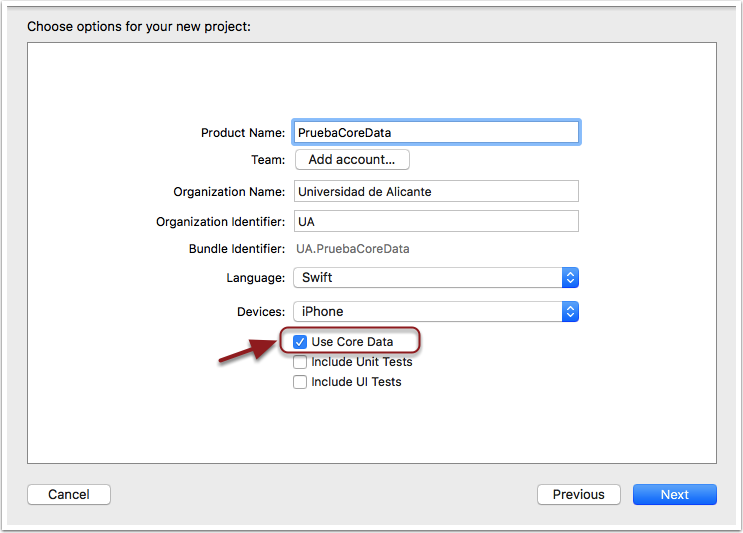

## El *stack* de Core Data

Vamos a introducir las funcionalidades básicas de Core Data implementando una pequeña aplicación para almacenar y listar notas de texto.

Lo primero que necesitamos para poder trabajar con Core Data es inicializar su *stack*, es decir instanciar las clases y crear los archivos de configuración necesarios para poder almacenar y recuperar objetos persistentes. 

Para comenzar a hacer pruebas no es necesario escribir este código de inicialización, Xcode lo puede hacer por nosotros. Para ello, hay que marcar la casilla de "Use Core Data" que aparece al crear un nuevo proyecto de Xcode, tras elegir la plantilla. **Crea un nuevo proyecto `NotasCoreData` usando como plantilla *Single View App** y asegúrate de que en la segunda pantalla del asistente de creación **marcas la opción de "Use Core Data"**.



Marcar esta casilla tiene dos efectos:

- Crea un archivo con el mismo nombre del proyecto y extensión `.xcdatamodeld` donde se va a almacenar nuestro modelo de datos
- Incluye una serie de métodos auxiliares en la clase `AppDelegate` para ayudarnos a trabajar con Core Data sin tener que escribir código partiendo de cero, ya que la parte de inicialización es algo tediosa, o al menos lo era hasta iOS 10.

Reconociendo que la inicialización del *stack* era laboriosa, desde iOS 10 Apple la ha encapsulado en una nueva clase que simplifica considerablemente el código. Por eso hay dos variantes en el *stack*: el caso en que podamos compilar para iOS 10 o posterior y el caso en que necesitemos mantener la compatibilidad con versiones anteriores 

> El código que genera automáticamente Xcode no es apropiado para los casos más complejos, en los que necesitemos por ejemplo gestionar la concurrencia. Tampoco parece muy adecuado el sitio donde se inserta el código, en la clase `AppDelegate`, sería mejor tenerlo en una clase aparte. No obstante nos vale para empezar a trabajar con el API sin preocuparnos por el momento de escribir nosotros el código.

### El *stack* a partir de iOS 10

Como podemos ver, el código de inicialización en este caso es muy simple (se han eliminado los comentarios)

```swift
lazy var persistentContainer: NSPersistentContainer = {
   let container = NSPersistentContainer(name: "PruebaCoreData")
    container.loadPersistentStores(completionHandler: { (storeDescription, error) in
        if let error = error as NSError? {
             fatalError("Unresolved error \(error), \(error.userInfo)")
        }
    })
    return container
}()

// MARK: - Core Data Saving support
func saveContext () {
    let context = persistentContainer.viewContext
    if context.hasChanges {
        do {
            try context.save()
        } catch {
            let nserror = error as NSError
            fatalError("Unresolved error \(nserror), \(nserror.userInfo)")
        }
    }
}
```

Básicamente, la clase que centraliza todo el manejo de Core Data es `NSPersistentContainer`. Es la que nos permite acceder al `NSManagedObjectContext`, mediante su propiedad `viewContext`. El contexto de persistencia es lo que necesitaremos para guardar y recuperar objetos. La función `saveContext` es una función de conveniencia para poder guardar el contexto de forma simple.

### El *stack* en iOS 9 y anteriores

> En Xcode 8 no existe la opción para generar el código de inicialización de Core Data sin usar los APIs de iOS 10. Sin embargo en Xcode 7 sí, y aquí tenemos el código generado. Podemos usar este código para nuestros proyectos en Xcode 8 que tengan como *target* iOS 9 o inferior.

```swift
lazy var applicationDocumentsDirectory: URL = {
    // The directory the application uses to store the Core Data store file. This code uses a directory named "com.cadiridris.coreDataTemplate" in the application's documents Application Support directory.
    let urls = FileManager.default.urls(for: .documentDirectory, in: .userDomainMask)
    return urls[urls.count-1]
}()

lazy var managedObjectModel: NSManagedObjectModel = {
    // The managed object model for the application. This property is not optional. It is a fatal error for the application not to be able to find and load its model.
    let modelURL = Bundle.main.url(forResource: "coreDataTemplate", withExtension: "momd")!
    return NSManagedObjectModel(contentsOf: modelURL)!
}()

lazy var persistentStoreCoordinator: NSPersistentStoreCoordinator = {
    // The persistent store coordinator for the application. This implementation creates and returns a coordinator, having added the store for the application to it. This property is optional since there are legitimate error conditions that could cause the creation of the store to fail.
    // Create the coordinator and store
    let coordinator = NSPersistentStoreCoordinator(managedObjectModel: self.managedObjectModel)
    let url = self.applicationDocumentsDirectory.appendingPathComponent("SingleViewCoreData.sqlite")
    var failureReason = "There was an error creating or loading the application's saved data."
    do {
        try coordinator.addPersistentStore(ofType: NSSQLiteStoreType, configurationName: nil, at: url, options: nil)
    } catch {
        // Report any error we got.
        var dict = [String: AnyObject]()
        dict[NSLocalizedDescriptionKey] = "Failed to initialize the application's saved data" as AnyObject?
        dict[NSLocalizedFailureReasonErrorKey] = failureReason as AnyObject?

        dict[NSUnderlyingErrorKey] = error as NSError
        let wrappedError = NSError(domain: "YOUR_ERROR_DOMAIN", code: 9999, userInfo: dict)
        // Replace this with code to handle the error appropriately.
        // abort() causes the application to generate a crash log and terminate. You should not use this function in a shipping application, although it may be useful during development.
        NSLog("Unresolved error \(wrappedError), \(wrappedError.userInfo)")
        abort()
    }

    return coordinator
}()

lazy var managedObjectContext: NSManagedObjectContext = {
    // Returns the managed object context for the application (which is already bound to the persistent store coordinator for the application.) This property is optional since there are legitimate error conditions that could cause the creation of the context to fail.
    let coordinator = self.persistentStoreCoordinator
    var managedObjectContext = NSManagedObjectContext(concurrencyType: .mainQueueConcurrencyType)
    managedObjectContext.persistentStoreCoordinator = coordinator
    return managedObjectContext
}()

// MARK: - Core Data Saving support

func saveContext () {
    if managedObjectContext.hasChanges {
        do {
            try managedObjectContext.save()
        } catch {
            // Replace this implementation with code to handle the error appropriately.
            // abort() causes the application to generate a crash log and terminate. You should not use this function in a shipping application, although it may be useful during development.
            let nserror = error as NSError
            NSLog("Unresolved error \(nserror), \(nserror.userInfo)")
            abort()
        }
    }
}
```

Vemos que entre las propiedades creadas hay una instancia del `NSManagedObjectContext`. Recordemos que esta es la principal clase con la que va a interactuar nuestro código, y la usaremos cuando queramos recuperar objetos persistentes, crear nuevos, guardar los que tenemos,... De hecho tenemos un método `saveContext` precisamente para guardar los objetos de forma más cómoda.

Además del contexto, tenemos propiedades para acceder al `NSPersistentStoreCoordinator`  y al `NSManagedObjectModel`, pero como ya hemos dicho, las usaremos de manera menos habitual.

Para ver las dependencias entre clases de Core Data podemos ir a lo que sucede cuando solicitamos la instancia del 
`NSManagedObjectContext`, que como hemos dicho varias veces va a ser la clase de uso más habitual en nuestro código. Al ser una propiedad `lazy`, si es la primera vez que accedemos a ella:

1. Se accede al `NSPersistentStoreCoordinator`. Al ser este también `lazy`, si el coordinador no ha sido todavía inicalizado
	1. Para inicializar el coordinador necesitamos el modelo de objetos (el `NSManagedObjectModel`. El modelo de objetos, a su vez, se inicializa con el recurso `nombre_del_proyecto.momd`. Este recurso se genera automáticamente a partir del archivo `xcdatamodeld`, y como hemos dicho es una especie de versión "binaria" o "compilada" del modelo.
	2. Obtenido el modelo, se puede inicializar el coordinador, especificando, entre otras cosas
		- El tipo de almacenamiento de persistencia en el parámetro `ofType`. En nuestro caso SQLite (`NSSQLiteStoreType`)
		- La URL donde reside el almacenamiento en el parámetro `at`, en nuestro caso el directorio `Documents`
2. Se inicializa el `NSManagedObjectContext` simplemente llamando a un inicializador
3. Se asocia el coordinador al contexto, asignando el coordinador creado a la propiedad `persistentStoreCoordinator` del contexto

