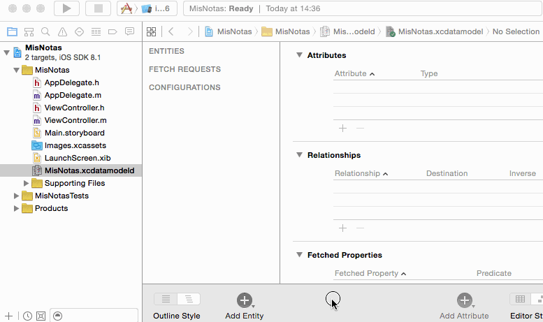

## Las entidades

### Crear las entidades (1 puntos)

Las entidades son los objetos que queremos hacer persistentes en nuestra aplicación. Debemos especificar sus propiedades (nombre y tipo) y como veremos en sesiones posteriores podemos establecer relaciones con otros objetos.

Para gestionar las entidades debemos editar el archivo `xcdatamodeld`. En el editor visual de Xcode podemos, entre otras cosas, añadir entidades. Vamos a crear la única entidad que necesitamos en nuestra aplicación: `Nota`. Para ello seguir estos pasos:

1. **Añadir una entidad** pulsando el botón `Add Entity` de la parte inferior. Creará una nueva entidad llamada por defecto `Entity`. Podemos cambiarle el nombre haciendo doble clic sobre él. 
    2. **Cambiarle el nombre a la entidad** a `Nota` 
    3. **Añadir atributos** pulsando sobre el botón `+` de la sección `Attributes`. Para cada atributo hay que especificar su nombre y tipo. Añadiremos dos atributos, `fecha`, de tipo `Date` y `texto` de tipo `String`

> IMPORTANTE: Los nombres de las entidades deben comenzar por mayúscula y los nombres de los atributos por minúscula. El editor no nos dejará hacer lo contrario.



### Crear datos persistentes (2 puntos)

Aquí nos ocuparemos de crear y guardar una nueva nota. Por el momento no se podrán editar ni borrar notas, para simplificar la aplicación, únicamente crear notas nuevas.

#### La interfaz de usuario para crear notas

En la (por el momento) única pantalla de la aplicación **añadir los siguientes componentes**:

- Un campo de texto de varias líneas (`text view`) para escribir la nota en sí.
- Una etiqueta (`label`) para mostrar la fecha y hora de la nota 
- Un par de botones, uno para **crear** una nueva nota en blanco y otro para **guardar** la nota actual
- Una etiqueta para mostrar mensajes al usuario

Una vez añadidos los componentes, hay que crear un *outlet* para las dos etiquetas y el campo de texto y así poder acceder a/cambiar su contenido por código. Recordad que hay que hacer `Ctrl+Arrastrar` desde el componente hasta el archivo donde queremos crear la propiedad (en nuestro caso `ViewController.swift`).

Además hay que crear un *action* para cada botón, para poder ejecutar nuestro código cuando se pulsen (con `Ctrl+Arrastrar` igual que antes). Debemos vincular los *action* al evento `Touch up inside`, que es el que aparece por defecto.

#### El código que implementa “crear nueva nota”

Debes implementar el código del *action* del botón "nueva nota" y simplemente limpiará la etiqueta de la fecha, el campo de texto de varias líneas y la etiqueta para mensajes al usuario, asignándoles a las tres la cadena vacía. 


#### El código que implementa el guardado

En el código del *action* asociado al botón de “guardar” debemos tomar el valor del campo de texto, crear una nueva nota con  este texto y la fecha y hora actual y hacerla persistente. Además actualizaremos la etiqueta con la fecha y hora actual para que muestre cuándo se ha guardado la nota. Vamos a ver esto paso a paso.

Para **crear un nuevo objeto persistente** debemos solicitárselo al contexto, ya que este debe gestionar su ciclo de vida y si lo creáramos nosotros llamando al inicializador el contexto desconocería de su existencia.

Lo primero por tanto es obtener la referencia al contexto de persistencia. Como hemos visto en la sección anterior, en la plantilla de Xcode se guarda todo lo de Core Data en el *application delegate*, por lo que vamos a obtenerlo de ahí

> En todo el tema vamos a suponer que estamos desarrollando para iOS>=10 y que por tanto vamos a poder usar la clase `NSPersistentContainer`.

```swift
if let miDelegate = UIApplication.shared.delegate as? AppDelegate {
    let miContexto = miDelegate.persistentContainer.viewContext
    ...
}
```

Hay que recalcar de nuevo que lo anterior no es propio de Core Data en sí, sino de la plantilla generada por Xcode.

Una vez que tenemos el contexto, para solicitarle la **creación de un nuevo objeto** podemos llamar al método de utilidad de la clase  `NSEntityDescription`llamado `insertNewObject(forEntityName:into:)` al que tenemos que pasarle el nombre de la entidad y la referencia al contexto.

```swift
//No te olvides de este import al principio del código
//es necesario para usar el API de Core Data
import CoreData
...
let nuevaNota = NSEntityDescription.insertNewObject(forEntityName: "Nota", 
                                                    into: miContexto)
```

Si imprimimos el tipo de `nuevaNota` veremos que es una especie de "tipo genérico": `NSManagedObject_Nota_`. Como no tenemos la clase `Nota` definida en Swift tenemos que **modificar sus propiedades** usando el método genérico `setValue`, al que le pasamos el nombre de la propiedad a modificar y el nuevo valor

```swift
nuevaNota.setValue("probando notas", forKey: "texto")
nuevaNota.setValue(Date(), forKey: "fecha")
```

> En tu proyecto **tendrás que modificar el código anterior** para que en lugar de asignar un texto fijo se le asigne el contenido del campo de texto.

Finalmente **guardamos el objeto en el almacenamiento persistente**. Esto se hace guardando el contexto. El método `save` puede lanzar una excepción que debemos tratar de algún modo, en este ejemplo usamos un `do...catch`

```swift
do {
   try miContexto.save()
} catch {
   print("Error al guardar el contexto: \(error)")
}
```

> El método de utilidad llamado `saveContext` de la plantilla generada por Xcode hace algo muy similar a lo anterior, aunque genera un error fatal que causa la terminación inmediata de la aplicación.

Faltaría **actualizar la etiqueta con la fecha y hora de la nota** para que refleje la fecha asignada, y también **actualizar la etiqueta con el mensaje al usuario que indique "nota guardada" o algo similar**. **Escribe el código necesario para hacer esto**.

> Tal y como está ahora el código, cada vez que pulses sobre `Guardar` se creará una **nueva nota**, así que aunque no modifiques el texto si pulsas varias veces tendrás varias notas, que serán iguales en contenido, aunque no con la misma fecha/hora). No es necesario que soluciones esto, déjalo así por el momento.

#### Ver los datos creados

> No es estrictamente necesario que sigas estos pasos en la práctica, pero sí que al menos los leas para poder entender mejor el funcionamiento interno de Core Data

Podemos "espiar" el almacenamiento persistente, que como ya hemos visto el código ha configurado como una base de datos SQLite con el mismo nombre del proyecto. Podemos localizar el archivo tecleando desde la terminal

```bash
find . -name MisNotas.sqlite -print
```

o más sencillo, usar alguna utilidad como [Simpholders](http://simpholders.com/), que ya hemos usado en otras sesiones para localizar el directorio con el *sandbox* de nuestra aplicación. En proyectos creados con Xcode 8 la base de datos se crea por defecto en el directorio `Library/Application Support` del *sandbox*.

Si abrimos la base de datos usando alguna utilidad gráfica o bien desde la terminal (moviéndose al directorio donde está el `MisNotas.sqlite` y tecleando:)

```bash
sqlite3 MisNotas.sqlite
```

Debería aparecer el *prompt* de SQLite donde podemos por ejemplo ver la estructura de la BD, tecleando

```bash
sqlite> .schema
```

Aparecerá algo como 

```sql
CREATE TABLE ZNOTA ( Z_PK INTEGER PRIMARY KEY, Z_ENT INTEGER, Z_OPT INTEGER,
  ZFECHA TIMESTAMP, ZTEXTO VARCHAR );
CREATE TABLE Z_PRIMARYKEY (Z_ENT INTEGER PRIMARY KEY, Z_NAME VARCHAR, Z_SUPER
  INTEGER, Z_MAX INTEGER);
CREATE TABLE Z_METADATA (Z_VERSION INTEGER PRIMARY KEY, Z_UUID VARCHAR(255),
  Z_PLIST BLOB);
```

Como se ve, Core Data crea automáticamente una tabla para la entidad `Nota`, con el mismo nombre (aunque precedida de una curiosa `Z`, como los nombres de los campos). Crea también una columna por cada propiedad, asignándoles el tipo apropiado. Además automáticamente crea una clave primaria, aunque en la entidad no hemos definido ninguna.

Podemos comprobar también si se ha guardado la nota ejecutando una sentencia SQL

```sql
sqlite> select * from ZNOTA;
```

> Es posible que el `select` anterior no muestre los registros actualizados, ya que a partir de iOS7 se usa un modo de SQLite que se llama "Write Ahead Logging".  En este modo, las transacciones para las que no se ha hecho *commit* se almacenan en un archivo `.wal` aparte. Para desactivar este modo consultar la documentación de Core Data.
