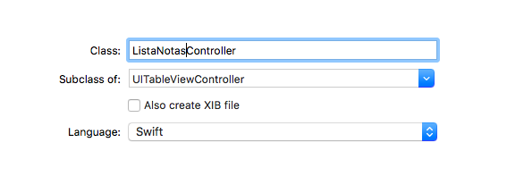

### Recuperar datos (4 puntos)

Vamos a añadir una pantalla donde se puedan consultar las notas que tenemos almacenadas. Las listaremos en una *table view* y por el momento se verán todas, no se podrá filtrar (añadiremos esa posibilidad cuando veamos la sintaxis de las "consultas" o *fetch requests*).

#### La interfaz de usuario

Sigue estos pasos:

- **Crear el Tab Bar Controller**: teniendo seleccionada la única pantalla de la aplicación, ve al menú y selecciona `Editor > Embed In > Tab Bar Controller`. Se creará el *tab bar controller*, por el momento con una única "solapa" que será la pantalla de creación de notas
- En la pantalla de creación de notas, pulsa sobre el item de la barra inferior para editarlo, y ponle como `Title` por ejemplo `Nueva`, para que se vea que es la pantalla de creación de notas
- Crear la pantalla para listar notas: Arrastrar al *storyboard* un `Table view controller`. Recuerda que es una especie de tabla a “pantalla completa”.
- Vincular la nueva pantalla al *tab bar controller*: hacer `Ctrl+Arrastrar` desde la pantalla del *tab bar* hasta la de listado de notas. En el menú contextual elegir como tipo del *segue* el de, `View Controllers` (bajo `Relationship Segue`).
    + Cambia el título del item de la barra inferior para que ponga "Lista" o algo similar. 
- Vamos a configurar la interfaz de la nueva pantalla
	- Cambia el aspecto del prototipo de la tabla: pulsa sobre la celda prototipo de la tabla, y en las propiedades cambia el `Style` a `Basic 
	- Pon un *reuse identifier*: pon algún `Identifier` por ejemplo `MiCelda` (recuerda que este identificador se emplea luego en el código para solicitar al sistema instancias reutilizables de celdas)
- Ahora vamos a configurar el controlador de la pantalla
	- Primero tenemos que crear un controlador (`File>New>File...`). De las plantillas que aparecen usa `Cocoa Touch Class`, así Xcode generará código por nosotros. La clase  se debe llamar `ListaNotasController` y heredará de `UITableViewController`. 



- Ahora hacer que la nueva clase sea el controlador de la pantalla de listado de notas: tienes que seleccionar la pantalla de listado de notas (primero de los iconos de la barra superior, el de fondo amarillo) y en el Identity Inspector (tercero de los iconos del área de la derecha), como "Custom Class" poner `ListaNotasController`

Puedes probar a ejecutar el proyecto para ver que funciona el cambio de pantallas. Evidentemente la lista de notas aparecerá vacía. Al menos, poniendo un `print` con algún mensaje en el `viewDidLoad` del `ListaNotasController` puedes comprobar que efectivamente se usa esta clase como controlador de la nueva pantalla. Cuando la muestras por primera vez debería aparecer el mensaje.

#### El código de la pantalla de listado

En la tabla vamos a dibujar un *array* de notas. Lo primero será definir una propiedad para almacenarlas en la clase `ListaNotasController`

```swift
//RECUERDA que hace falta este import
import CoreData

class ListaNotasController: UITableViewController {
   var listaNotas : [NSManagedObject]!

}
```

Fíjate que la definimos como un array de `NSManagedObject` es decir, de objetos gestionados por Core Data.

Solo nos queda rellenar el array de notas. **En `ListaNotasController` crea un método**

```swift
override func viewWillAppear(_ animated: Bool) {

}
```


Vamos a rellenarlo de código. Para recuperar datos de Core Data se usa un *fetch request*, que sería algo así como una consulta. para crearlo, inicializamos una instancia pasándole el nombre de la entidad resultado de la consulta. Para ejecutarlo, llamamos al método `fetch` del contexto. Veamos un ejemplo (todavía no tienes que introducirlo en el proyecto, luego veremos cómo). **Escribe el siguiente código en el `viewWillAppear`** (Recuerda que debes sacar de algún lado el contexto de Core Data (`miContexto`), como se hizo por ejemplo en la sección 3.3.):

```swift
let request : NSFetchRequest<NSFetchRequestResult> = NSFetchRequest(entityName:"Nota")
//"miContexto" es el contexto de Core Data 
//FALTA el código que obtiene "miContexto", como se ha hecho en ejemplos anteriores
if let notas = try? miContexto.fetch(request) as! [NSManagedObject] {
   for nota in notas {
       print(nota.value(forKey: "texto")!)
   }
}
```

Nótese que los *fetch request* usan tipos. Es decir, un *fetch request* es un *fetch request* que devuelve alguna clase determinada. Como por el momento no tenemos una clase `Nota`, usamos el tipo genérico `NSFetchRequestResult`

Si pruebas el proyecto, al navegar a la pantalla de lista, los textos de las notas deberían aparecer en la consola de Xcode (aunque no en la pantalla del simulador).

**Para que los datos de las notas aparezcan en la pantalla**, debes:

- Asignar el valor devuelto por `miContexto.fetch` a la propiedad `self.listaNotas`, que has creado antes
- Forzar el refresco de la tabla para que aparezcan los datos. Tras asignar el valor a listaNotas, haz `self.tableView.reloadData()`
- Modificar los métodos que ha creado Xcode:
	+ `numberOfSections` debe devolver 1 en vez de 0, ya que la tabla tiene 1 sección
	+ `tableView(_ tableView: UITableView, numberOfRowsInSection section: Int)` debe devolver el tamaño del array `listaNotas` (propiedad `count`)
	+ El siguiente método, que está comentado, debes descomentarlo, y hacer un par de modificaciones:
	   + Donde hace el `dequeReusableCell...`, cambia el identificador de la celda por el que hayas elegido tú antes al crear esta pantalla (aquí se sugería `MiCelda`)
	   + Donde pone el comentario `Configure the cell...` hacer que como texto de la celda aparezca el texto de la nota correspondiente

```swift
cell.textLabel?.text = self.listaNotas[indexPath.row].value(forKey: "texto") as? String
```