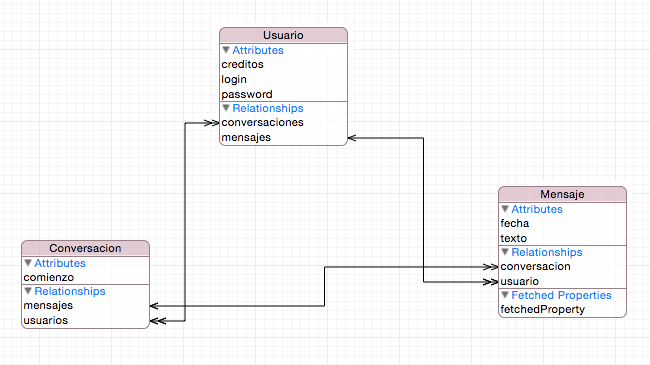

### Clases propias

En la aplicación de ejemplo de la primera sesión, las notas estaban representadas en el código por `NSManagedObject`, y accedíamos a las propiedades deseadas de cada nota usando KVC

```swift
for obj in resultados {
	let texto = obj.value(forKey: "texto") as! String
	print(texto)
} 
```

Cuando el modelo de datos es tan simple como el de la aplicación anterior esto no es un gran problema, pero cuando hay varias entidades, tratarlas todas como instancias de la misma clase `NSManagedObject` puede resultar en un código bastante confuso. La solución es *crear clases propias* que almacenen la información de las entidades. Estas clases deben heredar de `NSManagedObject`, y  tendrán unas propiedades que se corresponderán con las de la entidad.


#### Generación automática de las clases

Desde Xcode 8 las clases de nuestro modelo de datos se pueden generar automáticamente y de modo transparente para el desarrollador cada vez que guardemos el modelo de datos (el `.xcdatamodeld`). 

En el editor del modelo de datos, si seleccionamos una entidad y accedemos a sus atributos en el panel de la derecha, veremos que hay una sección titulada `Class` que se ocupa del código generado, podemos cambiar:

- El nombre de la clase generada (por defecto el de la entidad)
- El módulo de Swift donde se crea la clase (por defecto pone `Global Namespace`, lo que significa que no hará falta ningún `import` para referenciar la clase)
- En `codegen` por defecto aparece seleccionada la opción  `Class definition`, que indica que Xcode va a generar por defecto la clase asociada a la entidad. Con "Manual" habría que hacer la generación explícitamente.

Las clases se vuelven a generar si ha habido cambios cada vez que guardamos el modelo de datos (`File>Save` o `Cmd-S`). No se generan en el directorio del proyecto, de modo que no son visibles directamente, sino en un directorio aparte denominado `Derived Data`, donde Xcode coloca típicamente el código auxiliar generado por él. Este directorio por defecto está en otro lugar totalmente distinto del proyecto, podemos ver dónde está en la opción `File>Project Settings`, aunque no es necesario verlo ni recomendable por supuesto modificar el contenido generado.

> Si queremos "echarle un vistazo" al fuente de las clases generadas sin tener que ir a la carpeta podemos usar el "truco" de hacer `Cmd-Click` sobre el nombre de una clase que tengamos en el código. Xcode abre automáticamente el archivo en el que se define. Esto funciona con las clases de nuestro proyecto, con las autogeneradas y almacenadas en `Derived Data` e incluso con clases del sistema, como por ejemplo `UIViewController`.

Al tener clases Swift para las entidades del modelo de datos, nuestro código para crear un objeto persistente y modificar sus propiedades se simplifica. Por ejemplo para la entidad `Usuario` podemos hacer algo como

```swift
if let miDelegate = UIApplication.shared.delegate as? AppDelegate {
    let miContexto = miDelegate.persistentContainer.viewContext
    //creamos el objeto persistente, asociado al contexto
    let u = Usuario(context: miContexto)
    //modificamos sus propiedades
    u.login = "Pepe"
    u.password = "123456"
    //Guardamos el objeto
    //Deberíamos chequear si hay un error en el save, es solo para acortar el ejemplo
    try! miContexto.save()
}
```

Cuando una entidad tiene relaciones a uno o a muchos podemos manipular estas relaciones a través de propiedades y métodos de la clase generada. Veremos esto en la sección dedicada a CRUD.
 
#### Generación "semiautomática" de las clases

> Desde la versión 8 de Xcode el modo "automático" es el activo por defecto, y actualmente lo explicado en este apartado no es necesario. No obstante, se incluye aquí porque esta forma de trabajar nos permite ver el código generado dentro del proyecto, lo que puede ser instructivo en el proceso de aprendizaje.

Xcode tiene un asistente que puede crear las clases que representan a las entidades. Teniendo seleccionada una entidad cualquiera en el  editor del modelo de datos, elegimos la opción `Editor > Create NSManagedObject Subclass...` en el menú de Xcode. Se activará el asistente, que es bastante sencillo de usar. Solo tenemos que elegir el modelo de datos (si es que tenemos más de uno) y las entidades para las que vamos a generar clases.

Por cada entidad Xcode generará dos archivos. Uno de ellos es una clase con el mismo nombre que la entidad (aunque el nombre se puede cambiar, en la sección `Configuration` del editor del modelo de datos). El otro es una extensión de esta clase. En esta extensión se definen las propiedades de la entidad y un conjunto de métodos que nos facilitarán el trabajo con las relaciones entre entidades.

> Si tras generar las clases modificamos las entidades tendremos que borrar manualmente las clases generadas y volver a generarlas. Esto se ha solucionado en Xcode 8, como veremos en la siguiente sección.

Vamos a ver un ejemplo del tipo de código que genera Xcode. Si tuviéramos el modelo de datos de la figura



Tras generar clases para todas las entidades, acabaremos con 6 archivos fuente nuevos, dos por cada entidad. Para cada entidad, el primero de ellos tiene el mismo nombre que la entidad terminado en `+CoreDataClass.swift`. Si lo abrimos veremos que es la definición de una clase "vacía", marcada con algunas anotaciones especiales para que funcione correctamente la maquinaria interna de Core Data. Por ejemplo, para la entidad `Usuario` tendríamos algo como:

```swift
//  Usuario+CoreDataClass.swift
import Foundation
import CoreData

@objc(Usuario)
public class Usuario: NSManagedObject {

}
```

El segundo de los archivos para cada entidad tiene un nombre terminado en `+CoreDataProperties.swift`. Este archivo contiene una extensión de la clase anterior. El código generado tiene dos partes diferenciadas.

En primer lugar tenemos **la definición de las propiedades**, que en el ejemplo serían algo como

```swift
@NSManaged public var login: String?
@NSManaged public var creditos: Int16
@NSManaged public var password: String?
@NSManaged public var mensajes: NSSet?
@NSManaged public var conversaciones: NSOrderedSet?
```

Nótese que en la definición de la clase tenemos no solo las propiedades de la entidad en sí sino también **variables que representan las relaciones**. Por ejemplo en el diagrama puede verse una relación uno a muchos entre `Usuario` y `Mensaje` llamada `mensajes`, que representaría los mensajes enviados por un usuario. Esta relación se representa en código con la propiedad del mismo nombre. Esto quiere decir que si tenemos un usuario y vamos imprimiendo los objetos contenidos en la propiedad `mensajes` en realidad estaremos accediendo a la entidad `Mensaje`. Esto es mucho más sencillo y "limpio" que andar haciendo JOINs en SQL para obtener los datos relacionados.

Nótese que las relaciones "uno a muchos" se modelan con `NSSet` si no son ordenadas. Con esta estructura de datos no se nos garantiza un orden determinado al ir iterando por ella. En el caso de ser una relación marcada como ordenada Xcode habría generado un `NSOrderedSet`.

`NSSet` es el "equivalente" al  tipo `Set` de Swift, pero `NSSet` está definido en la librería `Foundation` y no en la librería estándar de Swift, ya que se desarrolló inicialmente para usarse en Objective C, que no tiene un tipo nativo para definir conjuntos. Hay que tener en cuenta que Core Data se desarrolló originalmente para Objective C, por lo que la infraestructura para implementarlo se ha "heredado" de éste.

`NSSet` y `NSOrderedSet` complican un poco el trabajo cuando en lugar de simplemente leer datos queremos modificarlos (añadir un nuevo mensaje a una conversación, por ejemplo), ya que en Objective C se diferencia entre colecciones *mutables* e *inmutables*. En Swift lo que hace que una colección sea mutable o no es si la declaramos con `let` o con `var`, como en el resto de tipos, pero en `Foundation` cada colección tiene dos variantes, la "versión" mutable y la inmutable. Así , los `NSSet` son *inmutables*, de modo que no podríamos añadir más elementos a la relación usando directamente la variable. Tendríamos que obtener una copia *mutable* de la colección y trabajar con ella. Una posibilidad para hacer esto es llamar al método `mutableSetValueForKey` de `NSManagedObject`, que nos devolverá un conjunto mutable para una propiedad determinada.

Para facilitar el trabajo con las relaciones "a muchos" Xcode también **genera métodos de acceso para las colecciones, o *accesores***. Estos accesores nos permiten añadir/eliminar elementos de la colección. En el caso del `Usuario`, generará algo como:

```swift
// MARK: Generated accessors for mensajes
extension Usuario {

    @objc(addMensajesObject:)
    @NSManaged public func addToMensajes(_ value: Mensaje)

    @objc(removeMensajesObject:)
    @NSManaged public func removeFromMensajes(_ value: Mensaje)

    @objc(addMensajes:)
    @NSManaged public func addToMensajes(_ values: NSSet)

    @objc(removeMensajes:)
    @NSManaged public func removeFromMensajes(_ values: NSSet)
}
```

De este modo en nuestro código podemos establecer una relación entre un determinado usuario y un determinado mensaje sin más que llamar al método `addToMensajes`. Por ejemplo podríamos hacer algo como:

```swift
//omitimos la parte en la que obtenemos una referencia al contexto de Core Data
let u = NSEntityDescription.insertNewObject(forEntityName: "Usuario", into: miContexto) as! Usuario
u.login = "Pepe"
u.password = "123456"
let m = NSEntityDescription.insertNewObject(forEntityName: "Mensaje", into: miContexto) as! Mensaje
u.addToMensajes(m)
try! miContexto.save() 
```


