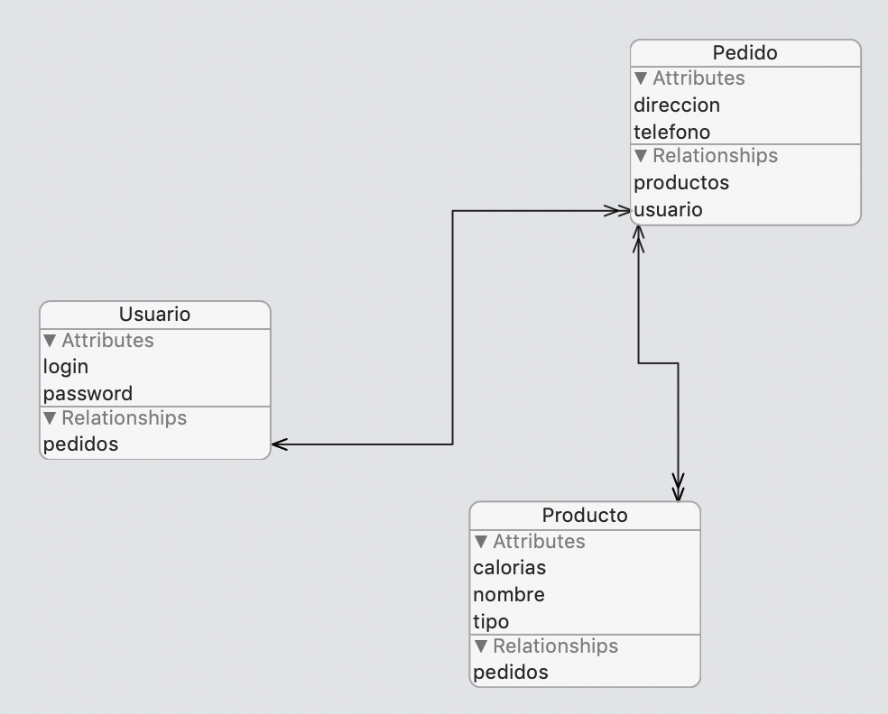

## Ejercicios de modelos de datos

### Creación del modelo (3 puntos)

En un restaurante que sirve comida a domicilio los *usuarios* pueden hacer *pedidos* de los *productos* del restaurante. Cada usuario tiene un login y un password. Cada pedido tiene un teléfono y una dirección de entrega. Y cada producto tiene un nombre, un tipo (pizza, ensalada, postre,...) y las calorías que contiene. La siguiente figura muestra el modelo de datos anterior. Recuerda que las dobles puntas de flecha significan *a muchos*. 



> Con el modelo anterior un pedido no podría tener más de una instancia de un producto. Esto no es nada realista pero lo dejaremos así para simplificar el modelo.

Crea un proyecto `Restaurante` y en él crea el modelo de datos que se describe en el párrafo anterior, con las entidades descritas y las relaciones entre ellas que creas convenientes.

### Pruebas con el modelo (4 puntos)

> Para simplificar no hace falta que hagas un interfaz gráfico para la aplicación. Puedes hacer las siguientes pruebas escribiendo directamente el código en el `viewDidLoad` del `ViewController`, y mostrar los resultados a base de `print`. 

Escribe código que inserte datos fijos:

- Cree varios productos
- Cree un pedido y añada los productos anteriores al mismo
- Cree un usuario y le añada el pedido

Para evitar que cada vez que arrancas la aplicación se vayan duplicando los datos puedes borrar inicialmente los datos que haya en las tres entidades llamando a esta función, que puedes copiar al `ViewController` o poner en una clase aparte:

```swift
func borrarDatos() {
    if let miDelegate = UIApplication.shared.delegate as? AppDelegate {
        let miContexto = miDelegate.persistentContainer.viewContext
        let requestUsuarios = NSFetchRequest<NSFetchRequestResult>(entityName: "Usuario")
        let borrarUsuarios = NSBatchDeleteRequest(fetchRequest: requestUsuarios)
        let requestProductos = NSFetchRequest<NSFetchRequestResult>(entityName: "Producto")
        let borrarProductos = NSBatchDeleteRequest(fetchRequest: requestProductos)
        let requestPedidos = NSFetchRequest<NSFetchRequestResult>(entityName: "Pedido")
        let borrarPedidos = NSBatchDeleteRequest(fetchRequest: requestPedidos)
        
        do {
            try miContexto.execute(borrarUsuarios)
            try miContexto.execute(borrarPedidos)
            try miContexto.execute(borrarProductos)
        } catch {
            // Error Handling
        }
    }
}
```

Para comprobar que todo es correcto haz una fetch request que obtenga todos los usuarios. Para cada usuario (aunque solo tendrás uno) ve recorriendo todos sus pedidos (haciendo uso de la relación de Core Data), y para cada pedido ve recorriendo todos sus productos e imprime sus datos.
