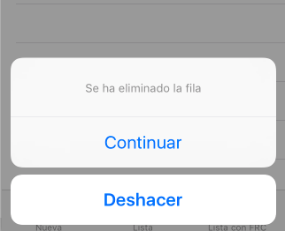

## Ejercicios de la sesión


En esta sesión vamos a continuar trabajando sobre la aplicación de notas de la primera sesión de Core Data. Necesitarás que esa sesión esté terminada para poder continuar en ella.

> Antes de ponerte a hacer las modificaciones de esta sesión asegúrate de que has hecho un `commit` con el mensaje `terminada sesión 3`. También puedes hacer un `.zip` con el proyecto, llamarlo `notas_sesion_3.zip` y adjuntarlo en las entregas de la asignatura. Así cuando se evalúe el ejercicio el profesor podrá consultar el estado que tenía la aplicación antes de estos ejercicios.


### Añadir la clase `Nota` (0,2 puntos)

Para realizar estos ejercicios lo primero que tienes que hacer es añadir una clase `Nota` que represente a la entidad `Nota`. Recuerda que Xcode lo puede hacer por tí, seleccionando la entidad en el editor del modelo y con la opción `Editor > Create managed object subclass...`.

En el panel de la derecha asegúrate que en `Module` aparece `Global Namespace` (es lo que aparece si borras el contenido del campo) y en `codegen` `Manual/none`. Si lo haces automático luego no podrás modificar el código de la clase.

**Al menos en la parte de creación de notas** modifica el código que tenías para que use la clase `Nota`. Cuando crees el objeto con `insertNewObject` tendrás que hacer el *cast* a `Nota`

```swift
let nuevaNota = NSEntityDescription.insertNewObject(forEntityName: "Nota", into: miContexto) as! Nota
```

Y cuando accedas a los atributos ya lo puedes hacer directamente en vez de con `set(value:forKey)` y `value(forKey:)` 

```swift
//En vez de...
nuevaNota.set(value:"EL TEXTO QUE HAGA FALTA ASIGNAR", forKey:"texto")

//ahora sería
nuevaNota.fecha = "EL TEXTO QUE HAGA FALTA ASIGNAR"
```

### Transformables (0,5)

Vamos a añadirle a cada nota un campo que sea un array de *tags*, o palabras clave, dicho de otro modo. Es decir, un array de Strings.

1. Añade el campo, llamado `tags` en el editor del modelo. Asígnale como tipo `transformable`
2. Vuelve a generar las clases para `Nota`. En `Nota+CustomDataProperties.swift` modifica el tipo del campo `tags` para que sea `[String]`, así no tendrás que andar haciendo *casts* manualmente a y desde `NSObject`
3. En la interfaz de usuario de alta de nota añade un campo de texto más. Allí el usuario debe escribir las *tags* como una lista de palabras separadas por espacios
4. Para pasar de una cadena separada por espacios a un array de Strings puedes usar el método de la clase `String` llamado `components(separatedBy:)`, que aplicado sobre una cadena la divide por la cadena "separadora" generando un array

```swift
"hola mundo".components(separatedBy:" ")  //devolvería ["hola", "mundo"]
```

### Deshacer operaciones (0,3)

Vamos a hacer que se puedan borrar notas en la pantalla de lista pero que la *app* nos dé la oportunidad de deshacer la operación.

Primero hay que hacer **que se puedan borrar filas**. Para que funcione el gesto del *swipe* a la izquierda, el *delegate* de la tabla tiene que implementar el método `tableView(_:,commit,forRowAt:)`. El *delegate* es `ListaNotasController`. Podéis descomentar el método, que aparece comentado, o mejor insertar directamente este, cuidado, faltan cosas que tendréis que rellenar:

```swift
override func tableView(_ tableView: UITableView, commit editingStyle: UITableViewCellEditingStyle, forRowAt indexPath: IndexPath) {
        if editingStyle == .delete {
            let miDelegate = UIApplication.shared.delegate as! AppDelegate
            let miContexto = miDelegate.persistentContainer.viewContext
            //FALTA: Eliminar del almacenamiento persistente
            ...
            do {
                //guardando el contexto
                try miContexto.save()
                //FALTA: Eliminar del array con el método "remove"
                //este método devuelve el objeto eliminado. Guárdalo en una
                //variable, te hará falta si hay que deshacer 
                ...
                //borrar visualmente la fila
                tableView.deleteRows(at: [indexPath], with: .fade)
            } catch {
                print("Error al intentar guardar")
            }
        }
    }
```

**Una vez implementadas las partes que faltan** en el código anterior, comprueba que efectivamente se pueden borrar las filas, y que eso borra la nota asociada. Es decir que al salir y entrar de la pantalla de lista de notas la nota borrada ya no vuelve a aparecer.

Para que el *undo manager* que vamos a meter luego nos funcione, hay que inicializarlo. En la clase `AppDelegate`, meter la siguiente línea (insertar en la línea 73, justo antes del `return container`)

```swift
container.viewContext.undoManager = UndoManager()
```

Ahora seguimos con `ListaNotasController`. Vamos a meter un *action sheet* que se muestre tras borrar la fila y nos dé la oportunidad de deshacer la acción. 



Introduce este código tras la línea con el `tableView.deleteRows` del código anterior:

```swift
let actionSheet = UIAlertController(title: "",
     message: "Se ha eliminado la fila",
     preferredStyle: .actionSheet)
let ok = UIAlertAction(title: "Continuar", style: .default)
let deshacer = UIAlertAction(title: "Deshacer", style: .cancel) {
     action in
     //AQUI FALTA
     // - llamar al "undo manager" para que deshaga la última operación
     // - volver a insertar en el array la nota borrada, en la misma posición

     
     //Esto ya está hecho, recargamos datos para que se repinten 
     tableView.reloadData()
}
actionSheet.addAction(ok)
actionSheet.addAction(deshacer)
self.present(actionSheet, animated: true)
```

Una vez implementado lo que falta en el código anterior, ya debería funcionar al completo la opción de deshacer