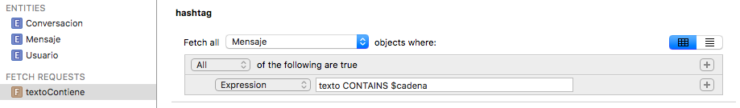

## Predicados para filtrar *fetch requests*

Hasta ahora hemos visto solo como crear *fetch request* que devuelvan todas las instancias de una entidad, lo que sería el equivalente a un `SELECT` sin `WHERE` en SQL. Por supuesto podemos filtrar los resultados de una *fetch request*, y esto lo haremos con **predicados**, que en el API se representan con la clase `NSPredicate`. Los predicados son un mecanismo genérico de Cocoa para filtrar colecciones de datos y pueden usarse no solo en Core Data, sino también para filtrar arrays o para buscar en *spotlight*, el mecanismo de búsqueda estándar de aplicaciones/contactos/documentos dentro de los dispositivos iOS.

Veamos un ejemplo de *fetch request* con predicado:

```swift
let miDelegate = UIApplication.shared.delegate as! AppDelegate 
let miContexto = miDelegate.persistentContainer.viewContext
let request = NSFetchRequest<Mensaje>(entityName: "Mensaje")
let pred = NSPredicate(format: "texto CONTAINS 'iOS'")
request.predicate = pred
let resultados = try! miContexto.fetch(request)
print("Hay \(resultados.count) resultados")
for mensaje in resultados {
    print(mensaje.texto!)
}
```

Como vemos, la única diferencia es que instanciamos un `NSPredicate` con la condición a cumplir y lo asociamos a la propiedad `predicate` del *fetch request*.

Podemos crear `NSPredicate` de tres formas distintas:

- **Definiéndolo como una cadena**, que se *parseará* y ejecutará como hemos hecho en el ejemplo anterior. En el ejemplo la consulta era "fija" pero también podemos pasar argumentos.
- Con un **template**, que básicamente es un predicado en forma de cadena en el que se incluyen variables, algo así como los parámetros de las *queries* en SQL. En Core Data podemos crear este tipo de predicados directamente desde el editor del modelo de datos, son las *fetch request templates* que ya comentamos.
- **Directamente en código**. Tenemos una serie de clases que representan diversas partes del predicado. Por ejemplo un `NSComparisonPredicate` nos permite representar un operador de comparación, un `NSExpression` una expresión (por ejemplo, como expresiones sencillas tendríamos una variable, un valor constante,…). Con un operador de comparación que una dos expresiones podemos conseguir algo como lo que hemos hecho en el ejemplo de la localidad. Esta forma de trabajar es engorrosa pero tiene su utilidad en algunos casos, por ejemplo cuando queremos generar dinámicamente una consulta partiendo de cero.

### Predicados como cadenas

Esta es la forma más habitual de definir predicados. El problema es que la cadena se interpreta en tiempo de ejecución, así que los errores de sintaxis no los vamos a detectar hasta entonces. Es algo muy similar a cuando ejecutamos sentencias SQL en nuestro código.

#### Operadores

Los predicados aceptan diversos tipos de operadores y funciones:

- Los típicos **operadores de comparación**: `=` (o `==`) `<`, `>`, `<=`, `!=` …
- **Operadores lógicos**: `AND`, `OR`, `NOT` (o también al estilo C, `&&`, `||`, `!`).
    - Operadores de **comparación de cadenas**: `BEGINSWITH`, `ENDSWITH`, `CONTAINS`, `LIKE` (como `CONTAINS` pero admite comodines `?` o `*`), `MATCHES` (comprueba si la cadena encaja con una expresión regular en [formato ICU](http://userguide.icu-project.org/strings/regexp)). Estos operadores por defecto distinguen entre mayúsculas/minúsculas y símbolos diacríticos (acentos, circunflejos, etc). Si después del operador ponemos un símbolo `c` entre corchetes indicamos que no queremos distinguir mayúsculas/minúsculas, y `d` hace lo propio con los diacríticos. Por ejemplo

```swift    
localidad CONTAINS[c] 'san'
```

Encajaría con “San vicente”, “Fuensanta”, “Massanassa”,…

Podéis consultar una referencia más completa en el apartado “[Predicate Format String Syntax](https://developer.apple.com/library/mac/documentation/Cocoa/Conceptual/Predicates/Articles/pSyntax.html#//apple_ref/doc/uid/TP40001795-CJBDBHCB)” de la  “[Predicate Programming Guide](https://developer.apple.com/library/mac/documentation/Cocoa/Conceptual/Predicates/AdditionalChapters/Introduction.html#//apple_ref/doc/uid/TP40001798-SW1)” de Apple. 

#### Caracteres de formato

En la cadena de la *fetch request* podemos emplear caracteres de formato al estilo de los que se usan en el `printf` de C, lo que nos permite pasarle parámetros. Por ejemplo:

```swift
let cadena = "iOS"
NSPredicate(format: "texto CONTAINS %@ AND fecha<%@", argumentArray: ["iOS", Date()])
```

Los caracteres de formato son *placeholders* donde se van colocando los argumentos que se pasan en forma de array. Los caracteres `%@` en concreto representan un *objeto* (en este caso un `String`). Al igual que en el `printf` de C podemos usar `%i` para enteros, `%f` para números reales, etc.

Nótese que, como habíamos visto en la sección anterior, las cadenas buscadas hay que ponerlas entre comillas (sean simples o dobles). El formateo tiene esto en cuenta y cuando un parámetro es de tipo `String` las inserta automáticamente. Esto, que es adecuado para los valores de las propiedades, no lo sería si queremos especificar dinámicamente la propiedad. Por ejemplo, el siguiente código

```swift
let atributo = "login";
let subcadena = "pep";
let pred = NSPredicate(format:"%@ CONTAINS[c] %@", argumentArray:[atributo, subcadena]);
```

generaría el predicado

```swift
'login' CONTAINS[c] 'usu'
```

que no es correcto porque los atributos no se ponen entre comillas. Para especificar que estamos poniendo un nombre de propiedad podemos usar el carácter de formato `%K`, y así el formateador no pondrá las comillas alrededor. La versión correcta del ejemplo anterior sería

```swift
let pred = NSPredicate(format:"%K CONTAINS[c] %@", argumentArray:[atributo, subcadena]);
```

### Templates

Como comentamos en sesiones anteriores, en el editor del modelo de datos de Xcode se pueden crear “*fetch request templates”* o dicho de otro modo, consultas “predefinidas”. Estas *templates* también se pueden crear por código, y la diferencia fundamental con las cadenas de formato es que en lugar de usar caracteres genéricos de formato emplean variables, lo que oficialmente se denominan *variable expressions* (un poco como la diferencia entre los parámetros por posición y con nombre en SQL).

En el editor del modelo podemos crear un *fetch request template* pulsando unos segundos (sin soltar) sobre el botón de `Add entity` para que aparezca el menú contextual, y elegir `Add fetch request`. El editor permite construir predicados más o menos de forma visual, o tecleando la expresión, que como hemos dicho puede contener variables. Las variables deben ir precedidas del símbolo `$` (`$cadena`, `$NOMBRE`,…)



> El editor visual de templates introduce comillas de más en los nombres de las variables, quedando expresiones como `nombre BEGINS WITH "$cadena"`. En este caso la variable no se reconocería como tal al estar entre comillas. Si vamos a usar variables es mejor usar el editor en modo texto. Podemos pasar a este modo pulsando el segundo de los botones que aparecen en la parte superior derecha del editor. 

Para ejecutar la *template* en nuestro código tenemos que recuperarla por nombre a partir del modelo de datos (el `NSManagedObjectModel`). Este modelo es accesible en la propiedad `managedObjectModel` del `PersistentContainer`. Además necesitaremos un diccionario que especifique nombre y valor para cada variable. Para el ejemplo de la figura anterior:

```swift
let miDelegate = UIApplication.shared.delegate as! AppDelegate
let miModelo = miDelegate.persistentContainer.managedObjectModel 
let dictVars = ["cadena":"iOS"]
if let queryTmpl = miModelo.fetchRequestFromTemplate(withName: "textoContiene", substitutionVariables: dictVars) {
    let results = try! miContexto.fetch(queryTmpl) as! [Mensaje]
    print("Hay \(results.count) resultados en la template")
    for mensaje in results {
        print(mensaje.texto!)
    }
}
```

### Predicados sobre relaciones

En los predicados podemos incluir no solo los atributos “simples”, sino también los que representan relaciones entre objetos. Así, buscar en una relación “a uno” es prácticamente igual que buscar en una propiedad convencional. Por ejemplo, vamos a buscar todos los mensajes enviados por un usuario cuyo login comience por `m` (relación `Mensaje`-\> `Usuario`). Para ello usaríamos un predicado como el que sigue:

```swift
let pred = NSPredicate(format:"usuario.login BEGINSWITH[c] 'm'")
```

Buscar en una relación “a muchos” es ligeramente más complicado, ya que estamos buscando en una colección. Podemos usar el operador `ANY` para verificar que algún valor de la colección cumple la condición. Por ejemplo podemos buscar todos los usuarios que han participado en alguna conversación en la última hora:

```swift
let haceUnaHora  = Date(timeIntervalSinceNow: -60*60)
let predicado = NSPredicate(format: "ANY conversaciones.comienzo>%@", argumentArray: [haceUnaHora])
```
