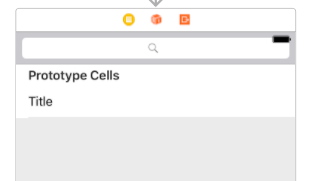

## Ejercicio: búsqueda en la aplicación de notas

Vamos a implementar una búsqueda por texto en la aplicación de notas sobre la que estáis trabajando en estar sesiones

> Antes de ponerte a hacer las modificaciones de esta sesión asegúrate de que has hecho un `commit` con el mensaje `terminada sesión 5`. También puedes hacer un `.zip` con el proyecto, llamarlo `notas_sesion_5.zip` y adjuntarlo en las entregas de la asignatura. Así cuando se evalúe el ejercicio el profesor podrá consultar el estado que tenía la aplicación antes de estos ejercicios.

### Preparación de la interfaz (1 punto)

En el *storyboard* arrastrar una `Search bar` a la parte superior de la pantalla de listar notas. 



Para que la barra de *status* de la parte superior (la hora, la batería,...) no moleste, "sobreescribimos" la propiedad `prefersStatusBarHidden`  en `ListaNotasController`

```swift
override var prefersStatusBarHidden: Bool {
    return true
}
```

Para poder interactuar con la *search bar* podemos convertir `ListaNotasController` en su *delegate*. Pasos:

1.- Establecer la **conexión**: `Ctrl+Arrastrar` desde la *search bar* hacia el icono que representa al controller en la parte superior. En el menú contextual de `Outlets` elegir `delegate`. Verificar en el panel de la derecha (inspector de conexiones) que la conexión está bien hecha.

2.- Hacer que `ListaNotasController` implemente el protocolo correspondiente: `UISearchBarDelegate`


```swift
class ListaNotasController: UITableViewController, UISearchBarDelegate {
 ...
}
```

3.- Implementar en `ListaNotasController` el método que responderá cuando el usuario escriba algo y pulse el botón `Search` en el teclado iOS


```swift
func searchBarSearchButtonClicked(_ searchBar: UISearchBar) {
   //El texto escrito en la barra es la propiedad "text" 
   print("buscando \(searchBar.text!)")
}
```

> Verás que *la barra de búsqueda se desplaza hacia arriba* de la pantalla si nos desplazamos por la tabla. Para que permanezca fija, lo más sencillo es no usar el `Table View Controller` del interfaz gráfico de Xcode, ya que su tabla “ocupa toda la pantalla” (la vista es la tabla en sí). En su lugar usaríamos un `View controller` normal y a él arrastraríamos una `table view` dándole las dimensiones deseadas y luego la `search bar`. Eso sí, tendremos que establecer  manualmente las conexiones de tipo *datasource* y *delegate* entre la vista de tabla y el controller, que con el `Table View Controller` son automáticas.

### Implementación del código de búsqueda (3 puntos)

Hecha toda la preparación de la interfaz, falta implementar la búsqueda en sí. En el método `searchBarSearchButtonClicked` **debes crear una fetch request que busque las notas cuyo texto contenga la cadena escrita** en la barra de búsqueda, sin distinguir mayúsculas/minúsculas o caracteres diacríticos. 

Recuerda que para que se actualicen los datos visibles debes llamar a `tableView.reloadData()`

Una vez comprobado que funciona, **mejora la fetch request para que las notas aparezcan en orden inverso por fecha**, de más reciente a más antigua. 

