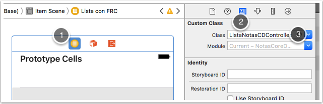

# Ejercicio: uso de fetched results controller

> Las modificaciones de estos ejercicios no afectan al código de las sesiones anteriores, así que no es necesario que hagas ninguna copia del estado del proyecto antes de empezar con esta sesión.

Vamos a ampliar la dichosa aplicación de notas para que use un *fetched results controller*. Para no afectar a lo ya hecho, haremos una tercera pantalla con un listado de todas las notas usando un `FetchedResultsController` (no es necesario implementar búsqueda como tienes en el otro listado)

## Interfaz gráfico (1)

Crea una nueva pantalla de tipo `Table View Controller`. Conecta la primera pantalla a esta (`Ctrl+Arrastrar` y elegir como tipo de *segue* `View Controllers`). Al final en la aplicación tendrás un *tab bar* con tres opciones.

> Haz una tercera pantalla, no cambies la que tenías para que no se pierda el código que hiciste en la sesión anterior. Evidentemente en una aplicación "normal" no tendría sentido tener dos pantallas con la lista de notas.

Para esta pantalla, crea una nueva clase `ListaNotasCDController` ("CD" de “Core Data”) que herede de `UITableViewController`. Recuerda que para que tu clase herede de una de iOS lo más sencillo es usar la plantilla "Cocoa Touch Class". 

Recuerda hacer en el *storyboard* que esta clase sea el *controller* de esta pantalla. Para ello, selecciona la pantalla de listado de notas (*clic* en el primero de los iconos de la barra superior, el de fondo amarillo)  y en el Identity Inspector ( tercero de los iconos del área de la derecha), como "Custom Class" elige `ListaNotasCDController`.



## Listar notas en la consola (1 punto)

Siguiendo el código de los apuntes y las transparencias **usa un *fetched results controller* para mostrar todas las notas en la tabla**. De momento cuando se inserten notas nuevas la lista no se actualizará. Primero simplemente haz que los datos aparezcan en la consola (consulta el apartado ["inicializar el fetched results..."](2_configuracion_basica.html)). 

## Listar notas en la tabla (1.5 puntos)

Una vez hecho esto, ya puedes listar las notas en la tabla. Consulta la sección [mostrar los datos en la tabla](3_tabla.html). El problema es que cuando insertes una nueva nota esta no se reflejará en la tabla, solo verás las que había al arrancar la *app*.

## Refrescar las notas de la tabla (1.5 puntos)

Para esto **hay que implementar lo que aparece en la sección ["Refrescar la tabla"](4_refrescar_tabla.html)** de los apuntes. Una vez hecho, comprueba que cuando insertamos una nota nueva en la pantalla de notas se muestra en la lista del *fetched results controller*
 
Para ver cómo se modifican las filas "en directo", haz que se puedan borrar notas haciendo *swipe to delete* en la tabla. Para que funcione este gesto, hay que implementar el método

## Eliminar filas (1.5 puntos)

```swift
override func tableView(_ tableView: UITableView, commit editingStyle: UITableViewCellEditingStyle, forRowAt indexPath: IndexPath) {
        if editingStyle == .delete {
            let miDelegate = UIApplication.shared.delegate as! AppDelegate
            let miContexto = miDelegate.persistentContainer.viewContext
            //FALTA: eliminar del contexto el objeto en la pos. indexPath
            //Tenéis que obtenerlo del fetched results controller
            //parecido a como se hace para pintar la celda
            ...
            //guardamos el contexto
            try! miContexto.save()
        }
}
```

Ahora puedes probar a borrar una celda haciendo sobre ella el gesto de *swipe* a la izquierda y ver que se actualiza la lista.

## Secciones de tabla (1.5 puntos)

Finalmente, haz que la tabla tenga secciones automáticas según la primera letra del texto de cada nota. Para ello:

- Crea una extensión de la clase `Nota` y añádele una propiedad calculada llamada `inicial` que devuelva solo esta:

```swift
//Archivo Nota+Custom.swift
import Foundation

extension Nota {
    //Devuelve una subcadena solo con la primera letra del texto
    @objc var inicial: String? {
        if let textoNoNil = self.texto {
            let pos2 = textoNoNil.index(after: textoNoNil.startIndex)
            return textoNoNil.substring(to:pos2)
        }
        else {
            return nil
        }
    }
}
```

- Cuando creas el *fetched results controller* hay que especificar en el parámetro `sectionNameKeyPath` la propiedad usada para dividir en secciones: "inicial".
- En el *datasource* de la tabla (en nuestro caso el *controller*) tienes también que implementar el método que genera los títulos de las secciones (`tableView(_:,titleForHeaderInSection)`). 
- Finalmente tendrás que cambiar el `NSSortDescriptor` con el que se crea el *fetched results controller* para que asegure que las notas no se "crucen" de sección. Ten en cuenta que si las sigues ordenando por fecha podría haber una que comience por "a", otra por "b" y luego otra por "a" otra vez, y eso no tendría sentido de cara a las secciones. Puedes conseguir que no haya problema si ordenas por texto en vez de por fecha.


