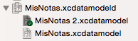

## Versiones del modelo de datos

Siendo la evolución progresiva del modelo de datos algo tan común en cualquier desarrollo de aplicación iOS es lógico que Core Data tenga algún mecanismo de *control de versiones*, para que sea accesible el historial de los sucesivos cambios. No estamos hablando del control de versiones general del proyecto, (`git` o el que sea que usemos), ya que con el "tradicional" Core Data no tiene acceso más que a la última versión del modelo.

Hasta ahora cuando hemos hecho cualquier modificación del modelo en nuestros proyectos simplemente la hemos hecho sin más y en su caso hemos guardado los cambios con `Cmd-S`. Pero esta no es la forma más adecuada de hacerlo. Lo que debemos hacer es especificar que queremos *crear una nueva versión* del modelo.

En cualquier momento dado podemos crear una nueva versión del modelo de datos y tener varias almacenadas en nuestro proyecto (varios archivos `xcdatamodeld`) aunque en cada momento solo una de ellas se tomará como la “actual”.

Para crear una nueva versión, seleccionar el `.xcdatamodeld` y en el menú de Xcode elegir `Editor > Add Model Version`. Aparecerá un cuadro de diálogo que nos pedirá el nombre para la nueva versión y qué versión actual toma como base. A partir de este momento podremos ver en el árbol de ficheros del proyecto una especie de *subárbol* con todas las versiones del `.xcdatamodeld`. La versión actual o activa en este momento aparece con una pequeña marca verde de verificación.

 

Para cambiar de versión activa, en el panel de la derecha, pulsar sobre el primer icono (`Identity and type`), y en la parte inferior del panel elegir la versión en el desplegable `Model Version`.

