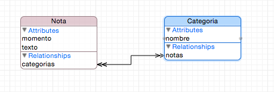
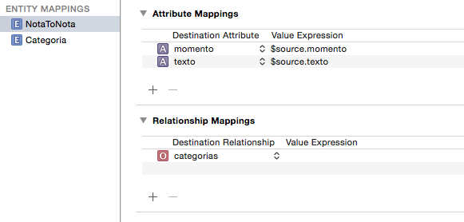
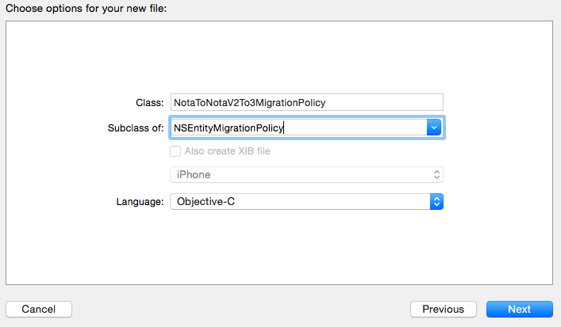
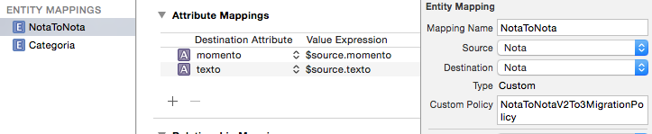
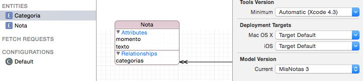

## Migraciones “pesadas”

Hay muchos cambios que no encajan en las operaciones previstas en las migraciones “ligeras”. Por ejemplo supongamos que tenemos el nombre y apellidos en un campo `nombre_completo` en el típico formato de *apellido_1 apellido_2, nombre* y queremos dividirlo en dos campos: `apellidos`  y `nombre` (o al contrario, partimos de dos y los queremos fusionar). En estos casos Core Data no puede inferir automáticamente la forma de transformar el modelo origen al modelo objetivo, y tenemos que especificar “manualmente” cómo hacer la transformación.

Como hemos dicho, la transformación entre un modelo y otro se representa en iOS mediante un *mapping model*, y es lo que tenemos que darle a Core Data para que pueda actualizar los datos al nuevo modelo.

Lo que hará Core Data durante el proceso de migración es cargar cada entidad en memoria, convertirla del modelo actual al nuevo ayudándose del *mapping model* y guardarla de nuevo en el almacenamiento persistente. Y hemos dicho Core Data, pero en realidad lo que tendremos que hacer será escribir nosotros código que haga esta tarea. Además del trabajo para nosotros, las migraciones de este tipo son mucho más costosas en tiempo y capacidad de procesamiento que las ligeras. Normalmente la aplicación necesitará mostrar al usuario un cuadro de diálogo o similar que le indique que se está realizando la operación.

Vamos a ver cómo se implementaría una migración “pesada” con un ejemplo concreto. Supongamos que en la aplicación de notas nos hemos dado cuenta de que el campo “categoria” no está del todo bien, ya que así solo podemos hacer que una nota pertenezca a una única categoría, y además cuando varias notas tienen la misma categoría cada una debe repetir el valor. Sería mejor tener una entidad “categoría” aparte y establecer una relación “uno a muchos” en ambas direcciones.

Lo primero es crear una nueva versión del modelo de datos con este cambio.

### Crear el “mapping model”

El nuevo modelo de datos tendrá el aspecto de la siguiente figura:



ahora tenemos que crear el *mapping model* que nos transforme el modelo actual en el nuevo modelo. En `File > New` seleccionamos la categoría `Core Data` y elegimos la plantilla `Mapping Model`. El asistente nos preguntará cuál es el modelo origen, cuál el destino, y nos pedirá un nombre para el nuevo archivo `.xcmappingmodel` que creará.

Si abrimos el archivo creado, veremos que Xcode ha intentado deducir la correspondencia entre el modelo origen y el destino. 



A la izquierda veremos los *Entity Mappings* (cómo pasar de una entidad antigua a una nueva). Típicamente a estos los llama con el nombre de la entidad antigua y la nueva, algo como `NotaToNota`. Para las entidades nuevas pone simplemente el nombre de la entidad. 

Para cada Entity Mapping tenemos los *Attribute Mappings* y los *Relationship mappings* correspondientes. Se usa un conjunto de variables predefinido para expresarlos. Por ejemplo, `$source` indica la entidad origen. De modo que si en un atributo vemos `$source.texto` indica que Xcode ha deducido que para generar este atributo tenemos que copiar el valor del atributo `texto` de la entidad original. Para una lista de variables se recomienda consultar la [sección correspondiente](https://developer.apple.com/library/ios/documentation/Cocoa/Conceptual/CoreDataVersioning/Articles/vmMappingOverview.html#//apple_ref/doc/uid/TP40004399-CH5-SW1) de la “[Core Data Model Versioning and Data Migration Programming Guide](https://developer.apple.com/library/ios/documentation/Cocoa/Conceptual/CoreDataVersioning/Articles/Introduction.html#//apple_ref/doc/uid/TP40004399-CH1-SW1)”.

### Crear la “migration policy”

De la migración entre entidades del modelo “antiguo” y del “nuevo” se encarga la clase `NSEntityMigrationPolicy`. Si queremos personalizar la migración, como es nuestro caso para generar la nueva entidad `Categoria` a partir de los valores del antiguo atributo `categoria`, tendremos que crear una clase propia que herede de ella:



Tendremos también que especificar en el Mapping Model que vamos a usar esta clase para hacer una migración de entidad determinada. Seleccionamos la migración `NotaToNota` y en las propiedades escribimos el nombre de la nueva clase en el campo `Custom Policy`.



En la clase hay una serie de métodos que podemos sobreescribir para adaptar la migración a nuestras necesidades, pero el único que suele ser necesario es `createDestinationInstances(forSource:in:manager:)`, que se debe encargar de crear a partir de una instancia de la antigua entidad, la nueva entidad (o nuevas, si debe haber más de una). Este método se irá llamando para cada una de las entidades actualmente en el almacén persistente, para irlas migrando una a una. 

Para nuestro problema particular, lo que debemos hacer en este método es obtener la categoría a la que pertenece la nota y crear una nueva entidad `Categoria` basada en ella. Después establecemos la relación entre la nota y su por ahora única categoría. Hay un pequeño problema a tener en cuenta: como habrá varias notas de la misma categoría no podemos crear directamente la entidad `Categoria`, solo la crearemos si no existe ya. Vamos a guardar las `Categoria` que creamos en un diccionario para poder saber las que ya hemos creado

```swift
var categorias : [String : NSManagedObject] = [:]
```
 
Aquí tenemos el código de la clase que hace la migración

```swift
import UIKit
import CoreData

class CrearCategoriasMigrationPolicy: NSEntityMigrationPolicy {
    //instancias de categorías que existen ya
    var categorias : [String : NSManagedObject] = [:]
    
    override func createDestinationInstances(forSource sInstance: NSManagedObject, in mapping: NSEntityMapping, manager: NSMigrationManager) throws {
        let notaOrigen = sInstance as! Nota
        let notaDestino = NSEntityDescription.insertNewObject(forEntityName: "Nota", into: manager.destinationContext) as! Nota
        //copiar propiedades básicas
        notaDestino.contenido = notaOrigen.contenido
        notaDestino.fecha = notaOrigen.fecha
        notaDestino.etiquetas = notaOrigen.etiquetas
        //si la nota tiene una categoría
        if let nombreCategoria = notaOrigen.categoria {
           //miramos si la categoría ya existe como entidad
           var categoria = categorias[nombreCategoria]
           //si no existe, creamos la instancia de la entidad
           if categoria==nil {
              categoria = NSEntityDescription.insertNewObject(forEntityName: "Categoria", into: manager.destinationContext)
              categoria?.setValue(nombreCategoria, forKey: "nombre")
              categorias[nombreCategoria] = categoria
           }
           //asociamos la entidad nota con la entidad categoría
           //como es una relación 1->N es un conjunto por ahora de un único elemento
           var catsDeNota = Set<NSManagedObject>()
           catsDeNota.insert(categoria!)
           notaDestino.setValue(catsDeNota, forKey: "categorias")
        }
        //Al final siempre hay que llamar a este método para establecer una correspondencia
        //entre entidad en el modelo actual y entidad en el nuevo
        manager.associate(sourceInstance: notaOrigen, withDestinationInstance: notaDestino, for: mapping)      
    }
}
```

Lo único que nos falta es configurar el *persistent store coordinator* para especificar que necesitamos una migración “pesada”. Tendremos que modificar el código de inicialización del *stack* de Core Data que se crea en la plantilla de Xcode al marcar `Use Core Data`: en el caso de estar usando la plantilla para iOS10 tendremos que modificar el código como sigue:

```swift
//En el AppDelegate
//Esta línea queda tal cual, las modificaciones vienen a partir de ella
//CUIDADO: el name cambia, según el nombre del proyecto
let container = NSPersistentContainer(name: "PruebaMigraciones")

let urls = FileManager.default.urls(for: .applicationSupportDirectory, in: .userDomainMask)
//CUIDADO: la cadena cambia, según el nombre del proyecto
let urlBD = urls[0].appendingPathComponent("PruebaMigraciones.sqlite")
let psd = NSPersistentStoreDescription(url: urlBD)
//que no se intente automatizar la migración
psd.shouldInferMappingModelAutomatically = false
psd.type = NSSQLiteStoreType

container.persistentStoreDescriptions = [psd]
```

Y ya está. Solo nos falta en el editor del modelo de datos *establecer como versión actual del modelo de datos la nueva versión*



Cuando arranque la aplicación iOS detectará que el modelo de datos actual es incompatible con el almacén persistente y verá que en las opciones se especifica que no se debe inferir automáticamente el “mapping model”. Por tanto buscará un “mapping model” compatible con la versión origen y destino del modelo de datos y lo aplicará.
