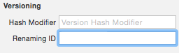

# Ejercicio de migraciones de datos

Vamos a hacer un par de modificaciones sobre el modelo de datos de (¡cómo no!) la aplicación de notas

> Antes de ponerte a hacer las modificaciones de esta sesión asegúrate de que has hecho un `commit` con el mensaje `terminada sesión 7`. También puedes hacer un `.zip` con el proyecto, llamarlo `notas_sesion_7.zip` y adjuntarlo en las entregas de la asignatura. Así cuando se evalúe el ejercicio el profesor podrá consultar el estado que tenía la aplicación antes de estos ejercicios.

## Migraciones “ligeras” (1 punto)

- Ve al modelo de datos y crea una nueva versión con `Editor > Add model version...`
- Edita esta nueva versión y en ella cambia de nombre el campo “texto” por “contenido”. 
- Tendrás que indicar que esto es un cambio de nombre y no un campo nuevo. Selecciona el atributo y en sus propiedades pon como `renaming ID` el nombre antiguo(el campo está al final del todo del panel, quizá tengas que hacer *scroll* para verlo).

- Tendrás que modificar manualmente el código fuente. Donde salga alguna referencia a la propiedad `texto`, tendrás que cambiarla por `contenido`
- Fija la nueva versión del modelo como la versión actual (primero de los iconos del panel de la derecha, campo `Current` en `Model Version`)

Ejecuta la aplicación y comprueba que todo sigue funcionando. Si accedes a la carpeta con la base de datos podrás comprobar que en la tabla `ZNOTA` se ha cambiado la columna `texto` por `contenido`