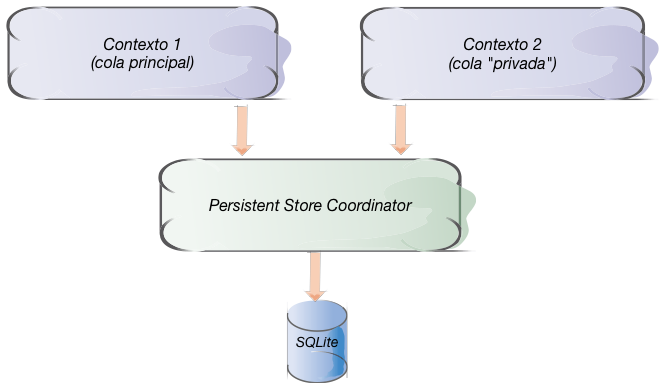

## Múltiples contextos para trabajos en *background*

Algunas operaciones con Core Data pueden ser bastante costosas en tiempo: por ejemplo una búsqueda en una base de datos con muchos registros, o la sincronización de los datos con un servicio web. Si efectuamos la operación en el hilo principal de la aplicación, donde trabajamos normalmente, la interfaz de usuario se quedará paralizada durante ese tiempo y la aplicación no responderá a los eventos, ya que la interfaz corre en ese hilo.

En la asignatura de introducción a iOS y a Swift ya vimos una solución a ese problema: las *colas de operaciones*, que básicamente son una forma de crear y gestionar operaciones concurrentes mucho más sencilla para el desarrollador que trabajar directamente con el API de *threads*. Por desgracia, los `NSManagedObjects` no son *thread-safe*, es decir, no se asegura que no se vayan a dar inconsistencias y problemas al acceder a un `NSManagedObject` desde distintos hilos. Así que en principio esta solución no es directamente aplicable.

Sin embargo, hay otra posibilidad que sí nos permitiría usar varios hilos: *tener varios contextos de persistencia, cada uno en un hilo distinto*. Un `NSManagedObject` pertenece solo a un contexto de persistencia, así que no habrá ningún problema si siempre para acceder a él usamos el *thread* asociado a su contexto. 

Lo único que necesitamos para solucionar el problema de las operaciones que bloquean la interfaz es un contexto adicional que funcione en un hilo secundario, y realizar la operación costosa con Core Data en este hilo. 

El contexto que crea el *stack* de Core Data por defecto está asociado al hilo principal de la aplicación, así que ese no nos sirve. En iOS el API para crear un nuevo contexto asociado a otro hilo es bastante sencillo, pero con la introducción del `NSPersistentContainer` en iOS10 ni siquiera es necesario que creemos nosotros mismos el contexto, el *container* lo hace por nosotros. Todo lo que tenemos que hacer es pasarle al método `performBackgroundTask()` el código a ejecutar en *background* en forma de clausura:

```swift
let miDelegate = UIApplication.shared.delegate as! AppDelegate
miDelegate.persistentContainer.performBackgroundTask() {
   contextoBG in
    let request = NSFetchRequest<Nota>(entityName: "Nota")  
    let lista = try! contextoBG.fetch(request)
    for nota in lista {
        //Aquí hacemos una operación costosa, como exportar cada nota a PDF
        //o subirlas a un servidor
    }
}
```

La clausura que se le pasa a `performBackgroundTask` tiene como parámetro el contexto de persistencia "secundario", creado por el `persistentContainer`. Este contexto se nos asegura que está asociado a una cola de operaciones distinta a la principal. Es decir, se estaría creando el *stack* que se muestra en parte en la siguiente figura.



En lugar de ejecutar directamente la operación también podemos pedirle al *container* que cree el contexto "secundario", para hacer luego lo que queramos (ejecutar varias operaciones en distintos momentos, por ejemplo) 

```swift
let miDelegate = UIApplication.shared.delegate as! AppDelegate
let contextoBG = miDelegate.persistentContainer.newBackgroundContext()
```

En versiones anteriores de iOS era necesario crear el contexto directamente (un objeto de la clase `NSManagedObjectContext`) y en el inicializador indicar que queríamos asociarlo a una cola de operaciones que no fuera la principal. Una vez creado el contexto, con los métodos `perform` o `performAndWait` podemos ejecutar una operación en su cola asociada. El primero es asíncrono y el segundo síncrono, como su propio nombre indica.

```swift
let nuevoContexto = NSManagedObjectContext(concurrencyType:.privateQueueConcurrencyType)
...
nuevoContexto.perform() {
   //Aquí vendría la operación costosa
   ...
}
```

> Crear el contexto tal cual se ha visto en este último ejemplo no tiene sentido de manera aislada. Para que funcione, el contexto de persistencia tiene que estar conectado a otras "piezas" del *stack* de Core Data, típicamente a un `NSPersistentStoreCoordinator`. Omitiremos esa parte para simplificar, pero para ello podrías adaptar el código generado por Xcode en versiones anteriores a la 8 que se vio en la primera sesión de Core Data.
