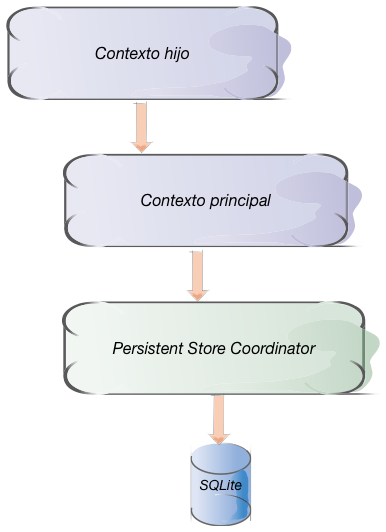

## Contextos anidados

El contexto de persistencia está conectado con un *Persistent Store Coordinator*, cuyo trabajo, como su propio nombre indica, es el de gestionar el almacenamiento persistente. Cuando almacenamos un objeto haciendo `save` del contexto, es el *store coordinator* el que se encarga de "pelearse" con la base de datos SQLite (o con el almacenamiento que sea). Cuando tenemos varios contextos, típicamente están todos "conectados" con el mismo *coordinator*.

En iOS5 se introdujo la posibilidad de tener un contexto "conectado" con otro en lugar de con un *coordinator*. Esto se conoce también como *contexto hijo*. El hijo está "conectado" con el padre y el padre es el "conectado" al *coordinator*. Cuando desde el hijo se hace un `save` no se están guardando los datos en el almacenamiento persistente, sino en el contexto padre. Es decir, los `save` del hijo representan modificaciones pendientes de almacenar para el padre. Para guardarlos en el almacenamiento persistente el padre también tendría que hacer `save`. 

Nótese que el `save` del hijo es una operación puramente en memoria, lo que implica dos cosas: es rápida y no es persistente. Precisamente estas dos características van a ser las que nos darán dos casos de uso para esta funcionalidad.

Vamos primero con el hecho de que el `save` del hijo no es una operación persistente. ¿Qué utilidad puede tener esto?. Pensemos en una aplicación que tenga una pantalla de edición de datos que implique la creación y relación entre sí de varios objetos. Por ejemplo si estamos editando un pedido de una tienda online tendremos varias entidades implicadas como `Pedido`, `Item`, etc. Si en un momento dado el usuario se "arrepiente" de hacer el pedido y quiere cancelarlo debemos ser capaces de poder eliminar todas las entidades que hemos creado en el proceso, y los cambios que hayamos hecho en las existentes. Los contextos anidados nos dan la posibilidad de implementar esta funcionalidad de forma muy sencilla: lo único que tenemos que hacer es crear todas estas entidades y hacer las modificaciones en un nuevo contexto hijo del principal. Para guardar los cambios que hagamos en ese contexto, haremos `save` en él y luego también en el principal. Si por el contrario queremos anular lo hecho en el contexto hijo en realidad no hace falta hacer nada especial. Simplemente no nos molestamos en hacer el `save` del hijo y seguimos trabajando con el padre.

Por otro lado podemos aprovechar que el `save` del padre es rápido al ser solo en memoria para implementar una funcionalidad de "guardar en *background*" de un modo alternativo a como vimos en el primer apartado de la sesión. La idea es tener un contexto hijo que funcione en la cola principal y uno padre en una cola en *background*. Este último está conectado al *persistent store coordinator*. El hijo es el contexto "principal", en el que vamos a trabajar todo el rato. Cuando tengamos que hacer alguna operación costosa de guardado de datos hacemos el `save` en el padre, que será muy rápido ya que es en memoria. El `save` del padre en el almacenamiento persistente ya no será tan rápido, pero al estar en una cola en *background* no va a afectar a la fluidez de la interfaz de usuario.